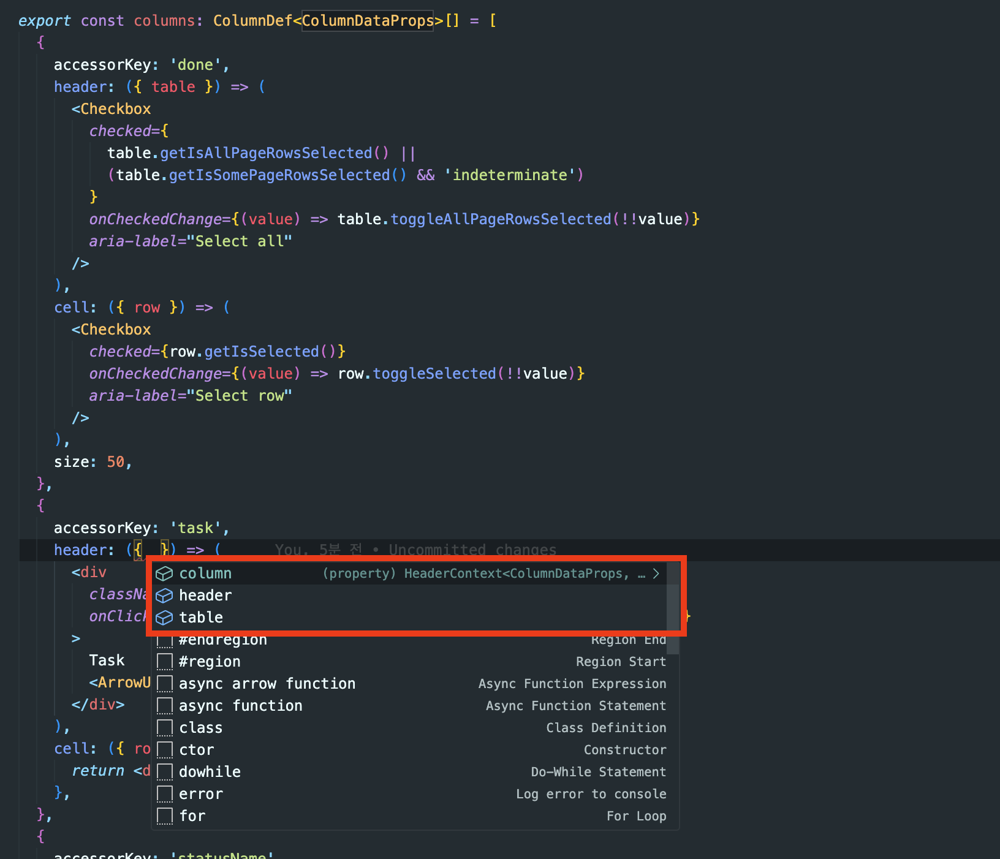
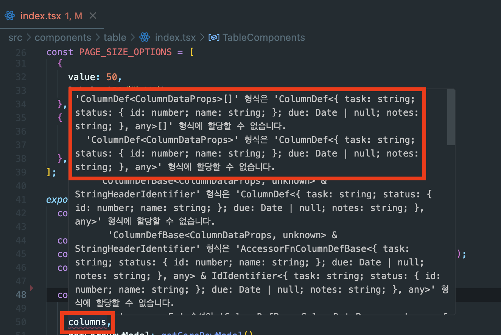
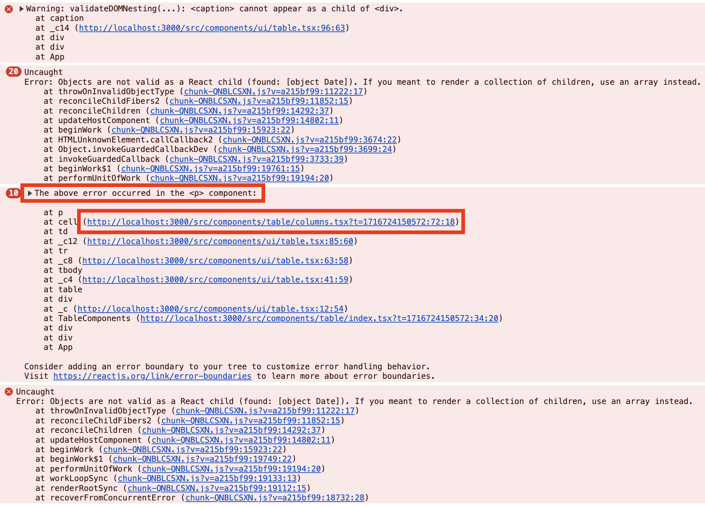
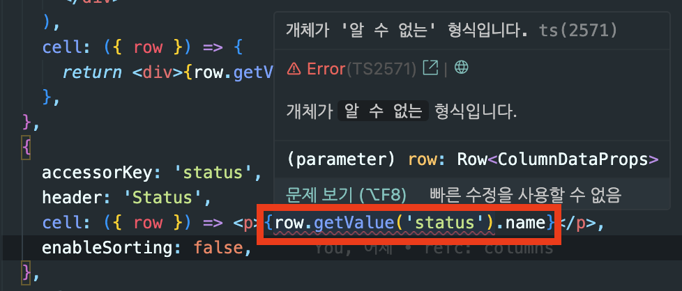

올해 초 이직을 하면서 주된 프로덕트가 어드민이다.  
어드민에서 테이블, 폼과 같은 구조를 많이 다루게 된다.  
처음 맡은 프로젝트에서 Tanstack-table을 사용했는데, 점점 사람들에게 알려지기도 하고,  
메인테이너가 [docs도 깔끔하게 정리 중](https://x.com/KevinVanCott/status/1788269291751760089)이라 더 관심이 간다.  
(초반 docs는 예시밖에 없었다;)

기본 바탕이 되는 내용은 [이전 글](https://geuni620.github.io/blog/2023/12/2/tanstack-table)에서 다뤘으니, 이번엔 재사용 가능하게 Tanstack-table을 구성해보려고 한다.  
shadcn/ui의 [Data Table docs](https://ui.shadcn.com/docs/components/data-table)를 참고했으며, 따라해보면서 겪었던 문제를 공유해본다.

<br/>

## 재사용가능한 구조로 나누기

```
- └── table
-     └── index.tsx


+ └── table
+     ├── columns.tsx
+     ├── pagination.tsx
+     ├── selection.tsx
+     └── data-table.tsx
```

<br/>

기존에는 모든 소스코드가 table 내 index.tsx에 포함되어있었다.  
table/index.tsx내 columns도, pagination, selection 모든게 포함되어있다.  
**즉, 한 번 사용할 순 있지만, 재사용하긴 어려운 구조다.**

폴더구조를 변경시킴으로써, 해당 부분에서 columns만 모아놓고 필요한 것만 빼내서 사용할 수 있다.

<br/>

### 1. columns.tsx

```TSX
// table/columns.tsx
-  const columnHelper = createColumnHelper<ColumnDataProps>();
-  const columns = [
-    //...
-  ];
```

기존엔 `createColumnHelper`를 사용했었고, [이전 글에도 createColumnHelper 더 권장](https://geuni620.github.io/blog/2023/12/2/tanstack-table/#4-typescript-%EC%A0%81%EC%9A%A9%ED%95%98%EA%B8%B0)했다.  
하지만, 이번에 적용해보면서, 타입설정해주기가 너무 까다롭다는 걸 알게됐다.  
data-table의 제네릭으로 내려주는 게 있는데, columns에서 타입에러를 뱉어냈다.  
고민하다가, 다음과 같은 방법으로 바꾸었다.

```TSX
// table/columns.tsx
+  import { type ColumnDef } from '@tanstack/react-table';

+  type Status = {
+    id: number;
+    name: string;
+  };
+
+  type ColumnDataProps = {
+    task: string;
+    status: Status;
+    due?: Date | null;
+    notes: string;
+    done: boolean;
+  };
+
+  export const columns: ColumnDef<ColumnDataProps>[] = [
+    {
+      accessorKey: 'done',
+      header: ({ table }) => (
+        <Checkbox
+          checked={
+            table.getIsAllPageRowsSelected() ||
+            (table.getIsSomePageRowsSelected() && 'indeterminate')
+          }
+          onCheckedChange={(value) => table.toggleAllPageRowsSelected(!!value)}
+          aria-label="Select all"
+        />
+      ),
+      cell: ({ row }) => (
+        <Checkbox
+          checked={row.getIsSelected()}
+          onCheckedChange={(value) => row.toggleSelected(!!value)}
+          aria-label="Select row"
+        />
+      ),
+      size: 50,
+    },
+    {
+      accessorKey: 'task',
+      header: ({ column }) => (
+        <div
+          className="flex cursor-pointer items-center justify-center"
+          onClick={() => column.toggleSorting(column.getIsSorted() === 'asc')}
+        >
+          Task
+          <ArrowUpDown className="ml-2 size-4" />
+        </div>
+      ),
+      cell: ({ row }) => {
+        return <div>{row.getValue('task')}</div>;
+      },
+    },
+    {
+      accessorKey: 'status',
+      header: 'Status',
+      cell: ({ row }) => <p>{row.getValue('status')}</p>,
+      enableSorting: false,
+    },
+    {
+      accessorKey: 'due',
+      header: 'Due',
+      cell: ({ row }) => <p>{row.getValue('due')}</p>,
+      enableSorting: false,
+    },
+    {
+      accessorKey: 'notes',
+      header: 'Notes',
+      cell: ({ row }) => <p>{row.getValue('notes')}</p>,
+      enableSorting: false,
+    },
+  ];
```

`ColumnDef`를 가져온 뒤, `columns`타입으로 지정해준다.  
이는 column의 header나, cell을 지정해줄 때도 잘 추론해준다.



<br/>

columns를 분리하고 난 뒤, 다음과 같은 타입에러가 뜬다.


```TS
  export type ColumnDataProps = {
    task: string;
    status: Status;
    due?: Date | null;
    notes: string;
+   done: boolean;
  };
```

원인을 찾아보니, 타입에는 done 프로퍼티 추가해줬는데, mocking 데이터에 done이 반영되지 않았기 떄문이었다.  
여기서 done은 행(row)의 체크상태를 관리하기 위한 데이터이다.

```JS
// data.js
const generateRandomData = () => {
  const data = [];
  for (let i = 0; i < 100; i++) {
    data.push({
      //...
      done: false, // 해당 부분 추가
    });
  }
  return data;
};

const DATA = generateRandomData();
export default DATA
```

<br/>

이 상태로 페이지를 띄워보자.  
화면이 흰색이라, 개발자도구를 확인해봤다.



columns 내에서 에러가 발생한 것 같다.  
대략 예상으론, cell의 \<p>태그 내, value가 잘 주입되어야하는데, 문제가 발생한 것 같다.

확인해보니, 두 가지 문제가 발생했는데, 첫 번째는 `Date format` 설정이 되어있지 않았다.  
[date-fns 라이브러리](https://github.com/date-fns/date-fns)를 통해, format을 지정해주었다.

```TSX
import { format } from 'date-fns';

export const columns: ColumnDef<ColumnDataProps>[] = [
  //...
  {
    accessorKey: 'due',
    header: 'Due',
    cell: ({ row }) => <p>{format(row.getValue('due'), 'yyyy/MM/dd')}</p>, //
    enableSorting: false,
  },
];
```

나머지 하나는 새롭게 알게된 점이다.  
Status 타입을 살펴보면, id와 name이 존재한다.  
그리고 ColumnDateProps의 status 프로퍼티에 Status 타입을 지정해주었다.  
즉, value를 가져오기 위해선 `row.getValue("status").name`으로 설정해줘야할 것 같지만, 타입에러가 발생한다.



어떻게 status 내부에 있는 name 프로퍼티를 가져올 수 있을까?

[공식문서 Column Defs의 Deep Keys](https://tanstack.com/table/latest/docs/guide/column-defs#deep-keys)를 살펴보면, 다음과 같이 적용할 수 있다.  
(이 부분은 개인적으로 정말 신기했다.)

```TSX
type Status = {
  id: number;
  name: string;
};

type ColumnDataProps = {
  //...
  status: Status;
};

  export const columns: ColumnDef<ColumnDataProps>[] = [
    //...
    {
-     accessorKey: 'status',
+     accessorKey: 'status.name',
+     id: 'name',
      header: 'Status',
-     cell: ({ row }) => <p>{row.getValue('status')}</p>,
+     cell: ({ row }) => <p>{row.getValue('name')}</p>,
      enableSorting: false,
    },
 ];
```

accessorKey는 객체일 경우 다음과 같이 사용하면 된다. → `status.name` 또는 `status.id`  
그리고 꼭 id를 추가해준다. → `id: name`  
마지막으로, cell에서 row.getValue를 name으로 변경한다. → `row.getValue("name")`  
이제 Status의 name을 가져올 수 있다.

만약 id를 가져오고 싶다면,  
accessorKey → `status.id`로 변경해주면 된다.  
단, `row.getValue()`는 데이터를 가져올 때, id를 참조한다.  
그래서 `id`와 `row.getValue(id)`는 동일해야한다.

### 2. pagination

```TSX
// table/pagination.tsx
import { Button } from '@/components/ui/button';

export const Pagination = ({ table }) => {
  return (
    <div className="mt-[10px] flex items-center justify-center gap-2">
      <Button
        variant="outline"
        size="sm"
        onClick={() => table.previousPage()}
        disabled={!table.getCanPreviousPage()}
      >
        {'‹'}
      </Button>

      <div className="text-sm font-bold text-slate-500">
        Page {table.getState().pagination.pageIndex + 1} of{' '}
        {table.getPageCount()}
      </div>

      <Button
        variant="outline"
        size="sm"
        disabled={!table.getCanNextPage()}
        onClick={() => table.nextPage()}
      >
        {'›'}
      </Button>
    </div>
  );
};
```

table/index.tsx 중 pagination에 해당하는 소스코드는 다음과 같다.  
여기서 타입지정이 중요한데, 제네릭으로 설정해주면 편하다.

```TSX
type PaginationProps<TData> = {
  table: Table<TData>;
};

export const Pagination = <TData,>({ table }: PaginationProps<TData>) => {
  return (
    //...
  );
};
```

글을 시작할 초반에, 메인테이너가 docs를 깔끔하게 정리중이라고 언급했었다.  
공식문서 중, [Data Guide](https://tanstack.com/table/latest/docs/guide/data#data-guide)를 살펴보면,  
제네릭 타입에 관한 잘 정리된 글을 확인할 수 있다.

문서에서 `TData`라는게 눈에 띄는데,  
내가 만든 예시에선 `Columns.tsx`에 존재하는, `ColumnDataProps`가 TData로 받게 될 것이다.

```TSX
type ColumnDataProps = {
  task: string;
  status: Status;
  due?: Date | null;
  notes: string;
  done: boolean;
};
```

이제 정리해보면, 다음과 같다.

```TSX
// table/index.tsx
import { Pagination } from '@/components/table/pagination';


export const TableComponents: React.FC = () => {
  const table = useReactTable({
   //...
  });

  return (
    <>
      //...

      <Pagination table={table} />
    </>
  );
};
```

<br/>

### 3. selection
