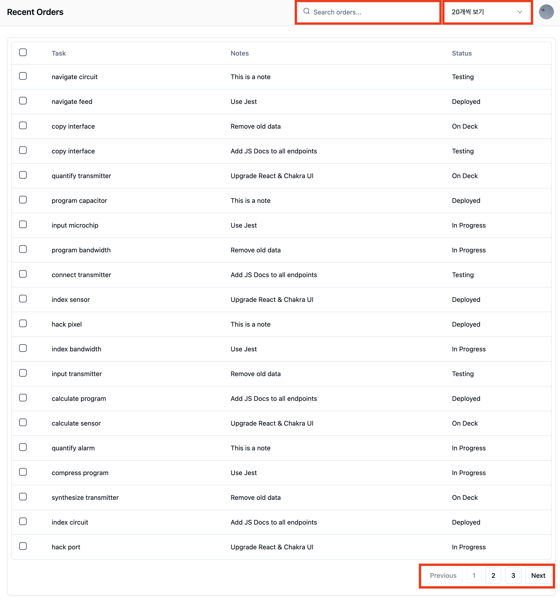
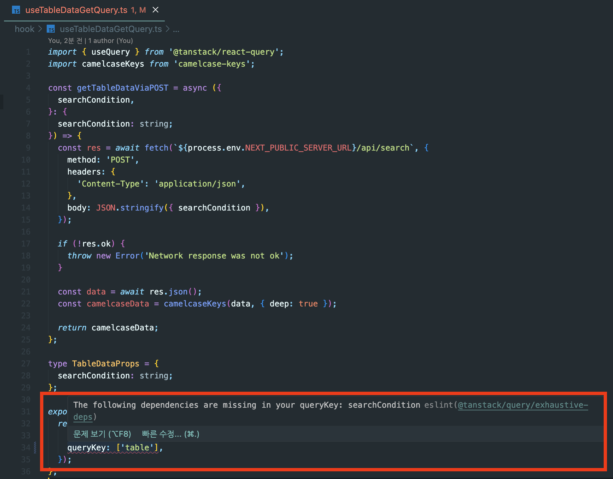
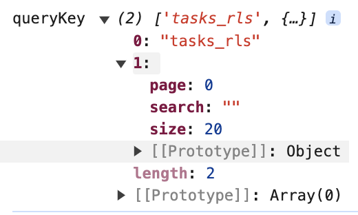
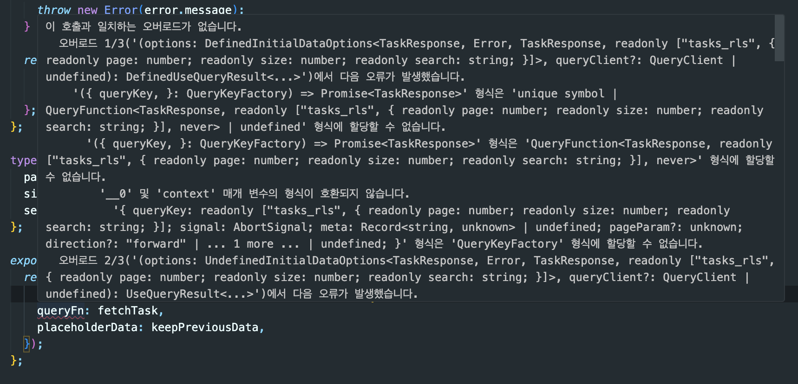

오랜만에 [Tkdodo](https://tkdodo.eu/blog/leveraging-the-query-function-context)의 글을 봤다.  
'이 글을 읽고, 비슷한 글을 썼던 것 같은데..' 기억이나 찾아본 결과,  
[이전에 작성한 글](https://geuni620.github.io/blog/2023/5/15/[Tanstack-query]%20QueryFunctionContext/)을 발견했다.  
도통 무슨말인지 이해가 안갔다.  
(그래서 다시 적는다; 😭)

<br/>

### QueryFunctionContext를 적용하게 된 계기

어떨 때 사용하는걸까?  
간단한 예시를 만들어봤다.  
대시보드가 있다.



빨간박스 부분을 주목해보자.  
사용자의 이벤트에 의해 state를 변경할 때마다,  
supabase의 params로 적용해서 Task 데이터를 가져올 것이다.  
Custom hooks으로 만들어보면 대략 이런 구조를 갖추게 될 것 같다.

```TSX
// useTaskGetQuery.ts
type FetchProps = {
  page: number;
  size: number;
  search: string;
};

// 총 몇개씩 가져올 것인지 → size
const fetchTask = async ({
  page,
  size,
  search,
}: FetchProps): Promise<TaskResponse> => {
  const start = page * size;
  const end = start + size - 1;

  let query = supabase
    .from(TASK)
    .select('*', {
      count: 'exact',
    })
    .order('id', { ascending: true })
    .range(start, end);

  if (search) {
    query = query.textSearch('task', search);
  }

  const { data, count, error } = await query;

  // ...
};

export const useTaskGetQuery = ({ page, size, search }: props) => {
  return useQuery({
    queryKey: [TASK, { page, size, search }] as const,
    queryFn: () => fetchTask({ page, size, search }),
  });
};
```

여기서 아래 부분을 주목해보자.

```TSX
export const useTaskGetQuery = ({ page, size, search }: props) => {
  return useQuery({
    queryKey: [TASK, { page, size, search }] as const,
    queryFn: () => fetchTask({ page, size, search }),
  });
};
```

지금은 queryKey에 `page`, `size`, `search`를 잘 반영했지만,  
만약 queryKey에 포함시키지 않고, fetchTask의 인자값으로만 넘겼다고 가정해보자.  
그럼, 위 스크린샷의 빨간박스를 변경해도, **해당 데이터를 새롭게 불러오지 못할 것이다.**

실제로 [이전 글](https://geuni620.github.io/blog/2024/4/7/use-query-post/)을 작성할 당시, [사용한 예시코드](https://github.com/Geuni620/use-query-post-method/blob/e8048156cd2b91f91a430fa55243512dc02401f5/hook/useTableDataGetQuery.ts#L31-L36)를 살펴보면, custom hooks으로 받아온 `searchCondition`을 queryFn과 queryKey에 모두 적용한 것을 확인할 수 있다.

하지만, 처음에는 완전히 놓쳤었다. 😭  
 **queryKey에 `searchCondition`을 추가하지 않았던 것이다.**  
고맙게도, [ESLint Plugin Query](https://tanstack.com/query/latest/docs/eslint/eslint-plugin-query)가 에러를 알려줬기 때문에 추가할 수 있었다.



<br/>

eslint가 적절히 알려주긴 하지만,  
적어도 useQuery내에서, 한번만 params를 넘겨주면 더 편하지 않을까?  
결론적으로 이렇게 말이다.

```TSX
export const useTaskGetQuery = ({ page, size, search }: props) => {
  return useQuery({
    queryKey: [TASK, { page, size, search }] as const, // 여기에 한번만 추가
    queryFn: fetchTask, // api만 호출
  });
};
```

이때 **QueryFunctionContext**가 유용할 것이다.

### QueryFunctionContext 적용하기

```TSX
export const useTaskGetQuery = ({ page, size, search }: props) => {
  //... 위와 동일함
};

const fetchTask = async ({
  queryKey,
}): Promise<TaskResponse> => {
  console.log("queryKeys", querykey) // log를 찍어보자.
  const [, { page, size, search }] = queryKey;
  // ..
};
```



아주 간단하게 다음과 같이 구성하면 된다.  
이로써, 단지 useQuery의 queryKey에만 집중하면 된다.  
api params는 api 호출 함수내에서 신경써주면 되는 것이다.  
(useTaskGetQuery에서 신경써야하는 부분이 2개에서 1개로 줄었다.)

<br/>

### 타입 적용하기

안전하게 사용하기 위해 타입도 적절히 추가해보자.

```TSX
// 타입을 생성
type QueryKeyFactory = [string, { page: number; size: number; search: string }];

// 반영
const fetchTask = async ({
  queryKey,
}: QueryKeyFactory): Promise<TaskResponse> => {
  const [, { page, size, search }] = queryKey;
  // ...
};

type props = {
  page: number;
  size: number;
  search: string;
};

export const useTaskGetQuery = ({ page, size, search }: props) => {
  return useQuery({
    queryKey: [TASK, { page, size, search }] as const,
    queryFn: fetchTask, // Error ❌
    placeholderData: keepPreviousData,
  });
};
```

처음엔 다음과 같이 타입을 추가했었다.  
하지만, queryFn에서 다음과 같은 에러를 뱉었다.



뭔가 복잡하게 적혀있지만, queryKey의 타입이 잘못된 것 같다는 생각을 했다.  
검색해본 결과, [stackoverflow에서 이 글을 발견했다.](https://stackoverflow.com/questions/73343133/what-is-the-react-query-querykey-typescript-type)

주목해야할 점은 query내에서 `QueryFunctionContext`타입을 제공해준다는 사실이다.  
[Tkdodo 블로그](https://tkdodo.eu/blog/leveraging-the-query-function-context#how-to-type-the-queryfunctioncontext)에도 이 타입을 사용했다.

나는 다음과 같이 반영했다.

```TSX
import { QueryFunctionContext } from '@tanstack/react-query';

const fetchTask = async ({
  queryKey,
  // QueryFunctionContext 타입
}: QueryFunctionContext<QueryKeyFactory>): Promise<TaskResponse> => {
  const [, { page, size, search }] = queryKey;
  // ...
};

// 추가로 useQuery로 명확히 타입을 지정해주는 게 좋을 것 같다.
export const useTaskGetQuery = ({ page, size, search }: props) => {
  return useQuery<TaskResponse, Error, TaskResponse, QueryKeyFactory>({
   //...
  });
};
```

### 결론 (+ queryFactory)

앞으로 params를 추가해줘야할 일이 있다면, `QueryFunctionContext`를 적극 사용할 것이다.  
추가로, 처음 queryKey를 배열기준으로 사용해서, 다음과 같이 적용했었다.

```TSX
const fetchTask = async ({
  queryKey,
}: QueryFunctionContext<QueryKeyFactory>): Promise<TaskResponse> => {
  // 사용되지 않는 맨 처음 인덱스를 비워야했다.
  const [, { page, size, search }] = queryKey;
  // ...
};
```

하지만, Tkdodo의 블로그 내용을 참고해보면, 아래와 같이 수정할 수도 있다.  
[query key factory](https://tkdodo.eu/blog/leveraging-the-query-function-context#query-key-factories)를 사용하는 것이다.

```TSX
// queryKeyFactory
const taskKeys = {
  all: [{ task: TASK }] as const,
  task: ({ page, size, search }: props) =>
    [
      {
        ...taskKeys.all[0],
        page,
        size,
        search,
      },
    ] as const,
};

const fetchTask = async ({
  // ✅ 구조분해할당으로 필요한 params만 가져온다.
  queryKey: [{ page, size, search }],
}: QueryFunctionContext<
  ReturnType<(typeof taskKeys)['task']>
>): Promise<TaskResponse> => {
  //...
};

export const useTaskGetQuery = ({ page, size, search }: props) => {
  return useQuery<
    TaskResponse,
    Error,
    TaskResponse,
    ReturnType<(typeof taskKeys)['task']> // return type
  >({
    queryKey: taskKeys.task({
      page,
      search,
      size,
    }),
    queryFn: fetchTask,
    placeholderData: keepPreviousData,
  });
};
```

위와 같이 사용하면, 구조분해할당으로 편하게 params를 가져올 수 있다!

### 참고자료

[Query Functions](https://tanstack.com/query/latest/docs/framework/react/guides/query-functions)  
[Leveraging the Query Function Context](https://tkdodo.eu/blog/leveraging-the-query-function-context)  
[What is the react query "queryKey" typescript type](https://stackoverflow.com/questions/73343133/what-is-the-react-query-querykey-typescript-type)
