Supabase를 사용할 때, 보통 Next.js로 사용해왔다.  
API 핸들링은 Next.js API 폴더 내에서, Supabase는 ORM처럼 사용하곤 했다.  
이번엔 React를 사용해서 Supabase를 써보려고 한다.

<br/>

# Row Level Security가 왜 필요할까?

예를 들어 이런 상황을 생각해보자.

```TSX
// utils/supabase.ts
import { createClient } from '@supabase/supabase-js';

export const supabase = createClient(
  import.meta.env.VITE_SUPABASE_URL,
  import.meta.env.VITE_SUPBASE_KEY,
);

// useTaskGetQuery.ts
const fetchTask = async () => {
  const { data, error } = await supabase.from(TASK).select('*');

  if (error) {
    throw new Error(error.message);
  }

  return data;
};

export const useTaskGetQuery = () => {
  return useQuery({
    queryKey: QUERYKEYS,
    queryFn: fetchTask,
  });
};
```

`VITE_SUPABASE_URL`과 `VITE_SUPABASE_KEY`는 env를 통해 설정해주었지만, 클라이언트 환경에선 완전히 숨길 수 없다.

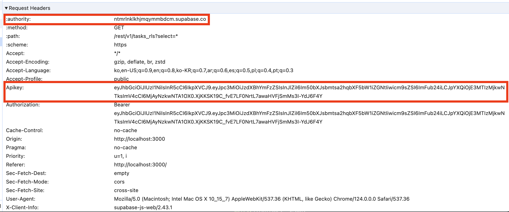

스크린샷처럼 API 요청시, 네트워크 탭을 확인해보면,  
env로 설정했던 URL과 KEY가 모두 드러나는 것을 확인할 수 있다.

이를 통해, 타 사용자가 내 DB에 저장된 소중한 데이터를 마음대로 삭제해버릴 수도 있다.

<!-- 이를 복사해서 API 요청, POST Method 뚫어서 확인하기 -->

<br/>

# Row Level Security 설정하기

이를 예방하기 위해 RLS를 설정해보자.  
해당 내용은 [생활코딩 Supabase 인증과 Serverless App](https://www.youtube.com/watch?v=yZ89etxVBKs) 영상을 참고했다.  
먼저 나는 supabase에서 프로젝트를 만들어놓은 상태에서 시작했다.

## 1. Github으로 로그인

먼저 만들어놓은 프로젝트의 왼쪽 메뉴에서 `Authentication`을 클릭한다.

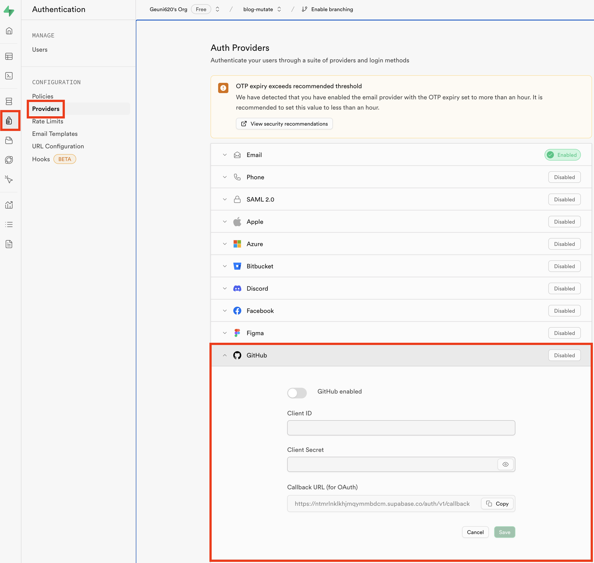

그리고 Github을 클릭했을 때 다음과 같이 Client ID와 Client Secret를 요구한다.  
(이때 github ID와 비밀번호를 **적는게 아니다.**)

이제 Github으로 이동한다.

- 로그인 이후, 오른쪽 상단에서 프로필 클릭 → 노출된 메뉴 중 `Settings`를 클릭해주자
- 이동된 페이지에서 왼쪽 메뉴들 중 가장 아래에 존재하는 `< > Developer settings`를 클릭해주자

그럼 아래와 같은 페이지가 나온다.

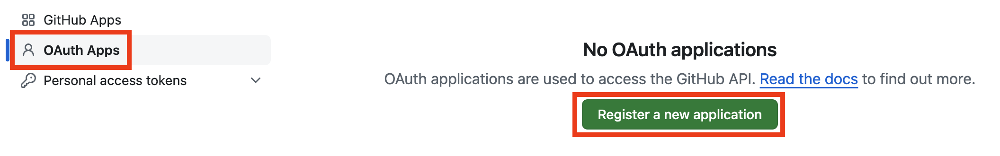

그리고 `Register a new apllication`을 누른다.

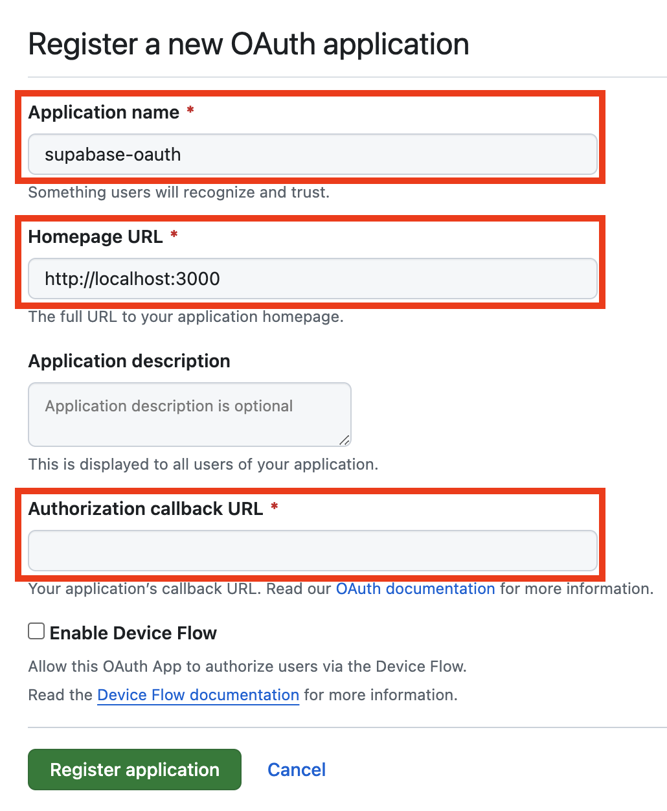

name과 URL, 그리고 callback URL을 입력해줘야한다.  
여기서 callback URL은 상단에 `Supabase Authentication`에서  
Github 창을 확인해보면 `Callback URL (for Auth)`라고 적힌게 있다.  
이걸 붙여넣으면 된다.

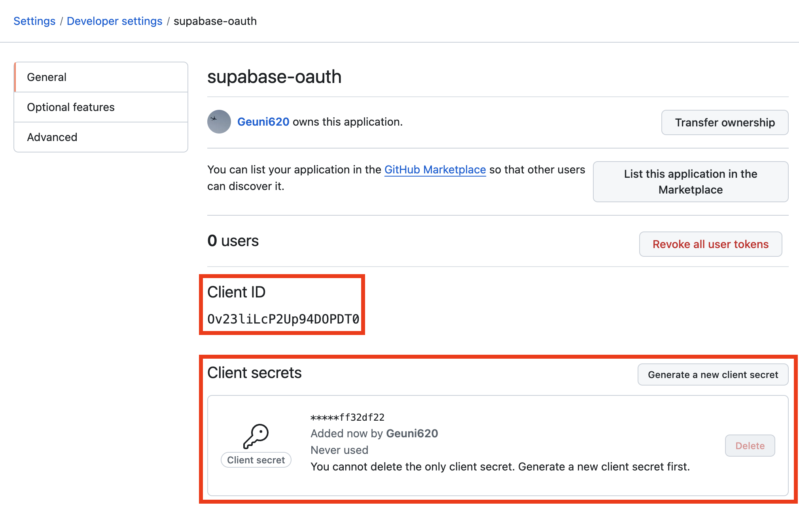

확인 버튼을 누르고 난 뒤, 새롭게 뜨는 페이지에서, Client ID와 secrets를 복사해서,  
`Supabase Authentication`로 이동한 뒤, 각각 붙여넣고 저장을 눌러주면 된다.

<br/>

## 2. 간단한 로그인 구현하기

이제 간단히 로그인을 추가해주자  
그 전에, supabase에게 나의 웹사이트가 신뢰할 수 있다는 사이트임을 알리는 '화이트리스트'처리를 해줘야한다.

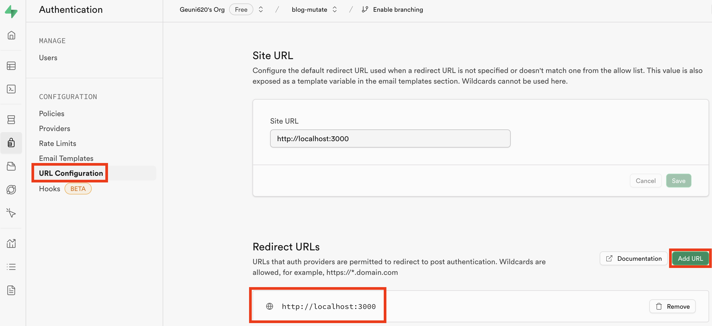

supabase의 Authentication → URL Configuration → Redirect URLS로 들어가자  
그리고 Add URL을 클릭한 뒤, 본인의 사이트 링크를 추가해주면 된다.

<br/>

그리고 간단한 Login UI를 추가해주자.

```TSX
// utils/supabase
import { createClient } from '@supabase/supabase-js';

export const supabase = createClient(
  import.meta.env.VITE_SUPABASE_URL,
  import.meta.env.VITE_SUPBASE_KEY,
);


// hooks/useLogin.ts
import { Session } from '@supabase/supabase-js';
import { useEffect, useState } from 'react';
import { supabase } from '@/utils/supabase';

const PROVIDER = 'github';

export const useLogin = () => {
  const [session, setSession] = useState<Session | null>(null);

  const onSessionChange = (session: Session | null) => {
    setSession(session);
  };

  const onLoginClick = async () => {
    await supabase.auth.signInWithOAuth({
      provider: PROVIDER,
      options: {
        redirectTo: import.meta.env.VITE_ORIGIN_URL,
      },
    });
  };

  const onLogoutClick = async () => {
    await supabase.auth.signOut();
  };

  useEffect(() => {
    supabase.auth.getSession().then(({ data: { session } }) => {
      onSessionChange(session);
    });

    const {
      data: { subscription },
    } = supabase.auth.onAuthStateChange((_event, session) => {
      onSessionChange(session);
    });

    return () => subscription.unsubscribe();
  }, []);

  return {
    session,
    onLoginClick,
    onLogoutClick,
    onSessionChange,
    setSession,
  };
};

// src/app.tsx
import { Dashboard } from '@/components/dashboard';
import { Login } from '@/components/login';
import { useLogin } from '@/hooks/useLogin';
import { useTaskGetQuery } from '@/hooks/useTaskGetQuery';

export const App = () => {
  const { session, onLoginClick } = useLogin();
  //...

  if (!session)
    return (
      <div className="absolute left-1/2 top-1/2 -translate-x-1/2 -translate-y-1/2">
        <Login onClick={onLoginClick} />
      </div>
    );

  return <Dashboard />;
};
```

코드를 작성하다보니, `VITE_SUPABASE_URL`와 `VITE_SUPBASE_KEY`, `VITE_ORIGIN_URL`가 눈에 띈다.  
먼저, `VITE_SUPABASE_URL`과 `VITE_SUPBASE_KEY`는 supabase 페이지에서 Settings의 API를 확인해보면,  
Project API Keys를 확인할 수 있다.

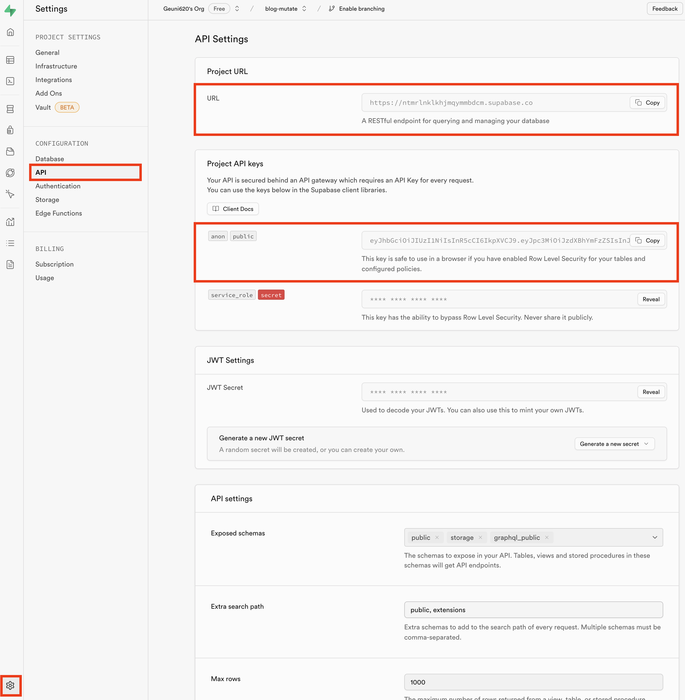

여기서 각각의 URL(Project URL)과 KEY(PRoject API Keys, public)를 추가해주면 된다.

<br/>

자, 그럼 화면에서 로그인 버튼을 클릭해서 로그인 해보자!

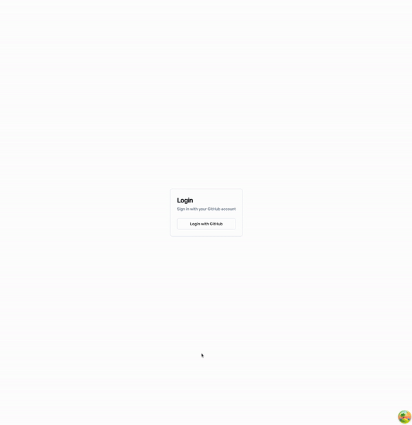

Github의 인증을 거쳐서 로그인이 완료된 것을 확인할 수 있다.

<br/>

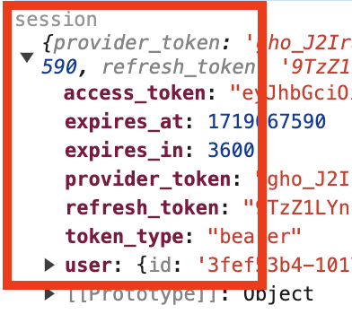
session state에 log를 찍어보면, Token 및 유저 정보가 담긴 것도 확인할 수 있다.

<br/>

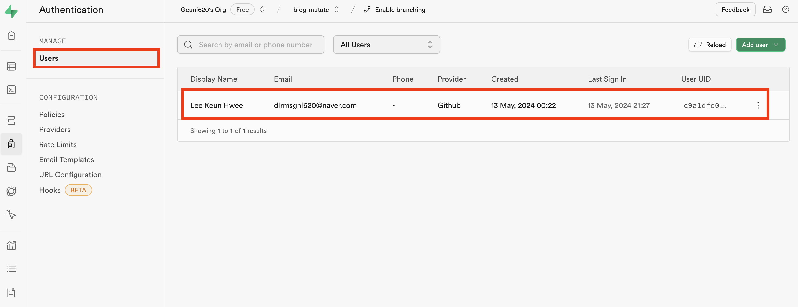

그리고 supabase 페이지내에서, 스크린샷과 같은 위치로 이동해보자.  
supabase 내에서도 로그인이 성공한 것을 스크린샷 이미지를 통해 확인할 수 있다.

<br/>

## 3. Row Level Security 적용하기

미리 supabase 내 테이블을 만들고, 데이터를 넣어두었다.  
하지만, RLS 설정은 하지 않은 테이블이다.

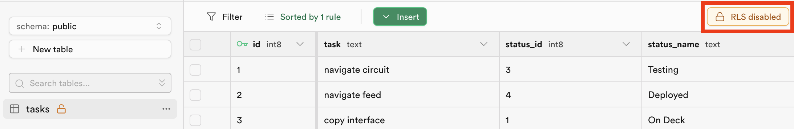

이 테이블을 복사한 뒤 RLS를 설정해보려고 한다.

```SQL
create table
  tasks_rls as
select
  *
from
  tasks
```

동일한 테이블을 생성했다.  
그리고 위 스크린샷에 나와있는 `RLS disabled` 버튼을 클릭해주자.  
이후 몇 번의 클릭을 유도하는 모달창들이 뜨는데, 모두 버튼을 클릭하고 나면,  
`RLS disabled` 버튼이 `Add RLS policy`로 변경된다.  
`Add RLS policy`를 클릭해주자.

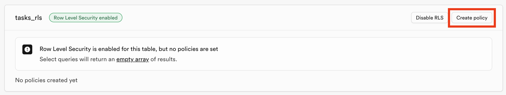

Create policy를 클릭!

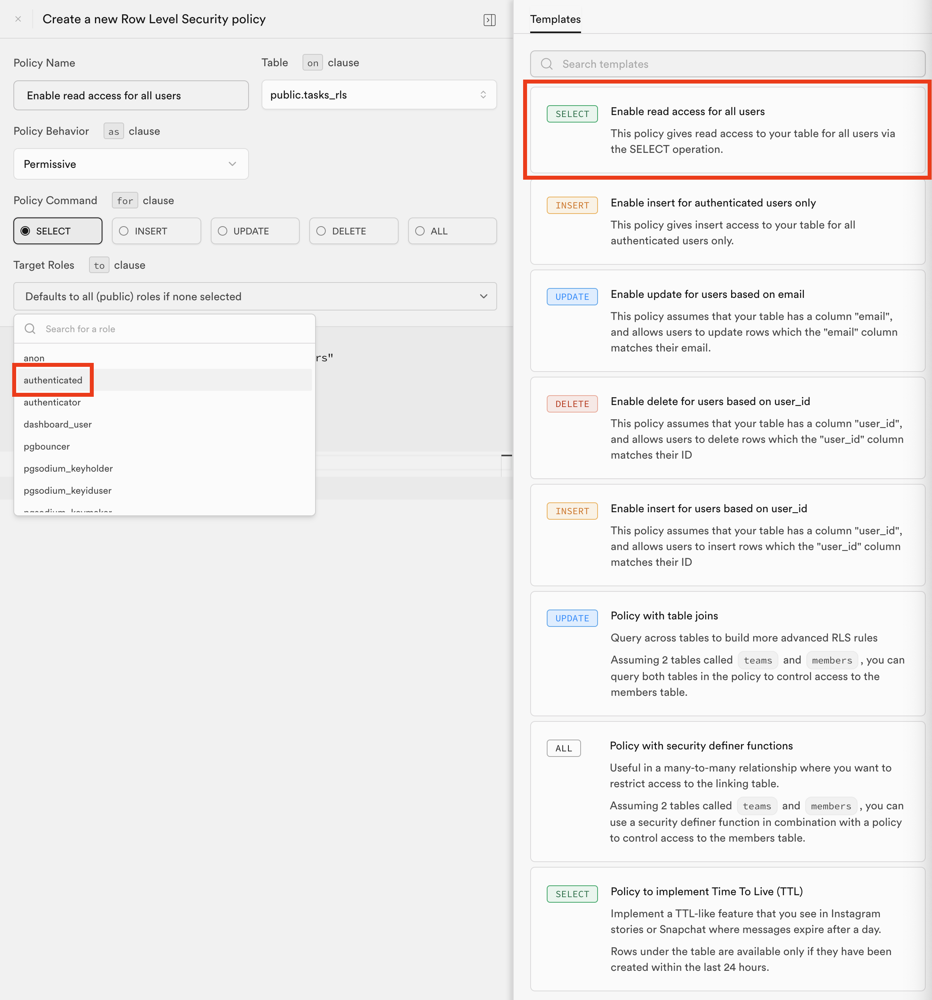

SELECT를 클릭하면, 기본 Templates로 왼쪽이 채워진다.  
여기서 `Target Roles`에 로그인 된 사용자만 데이터를 제공하기 위해,  
authenticated를 설정해주었다.

그리고 확인을 위해, 로그인 컴포넌트를 제거하고, Dropdown내 login 버튼을 추가해주었다.

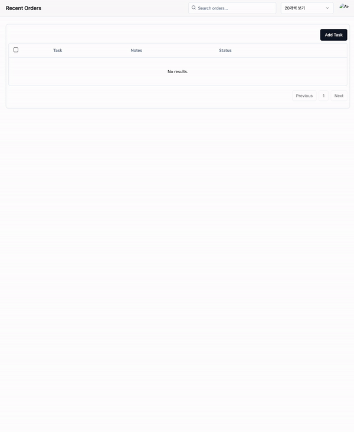

로그인 되었을 때만, 데이터가 보이는 것을 확인할 수 있다.

<br/>

# 참고자료

[Supabase - 인증과 Serverless App 구현하기](https://youtu.be/yZ89etxVBKs?si=72ZKjDEJDUNDp7Ou)  
[supabase 폼 미쳤다](https://velog.io/@racoon/supabase-%ED%8F%BC-%EB%AF%B8%EC%B3%A4%EB%8B%A4)
