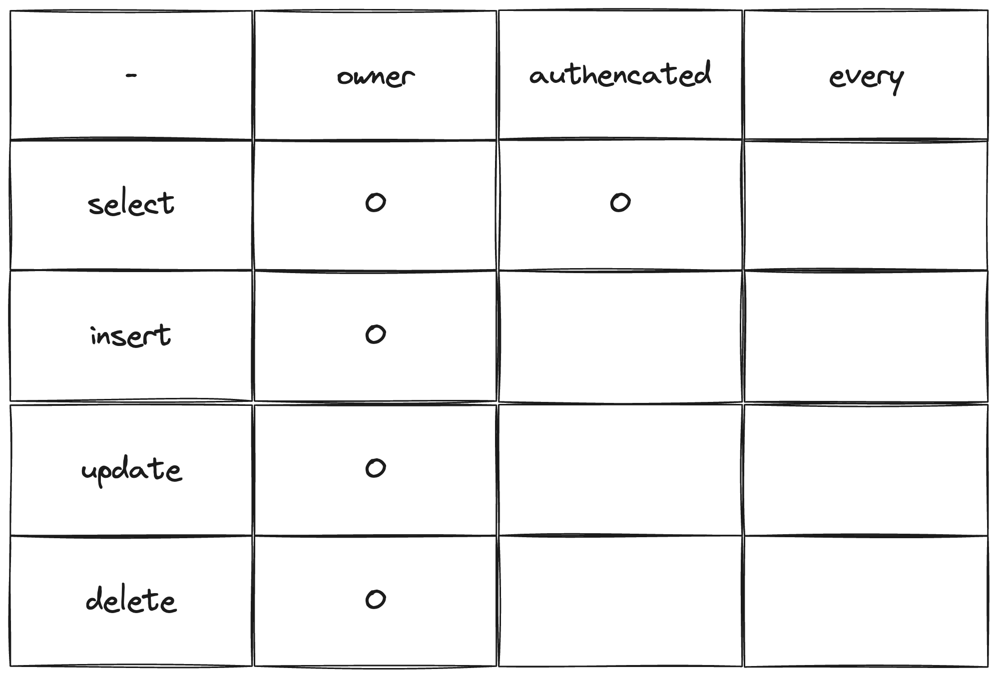
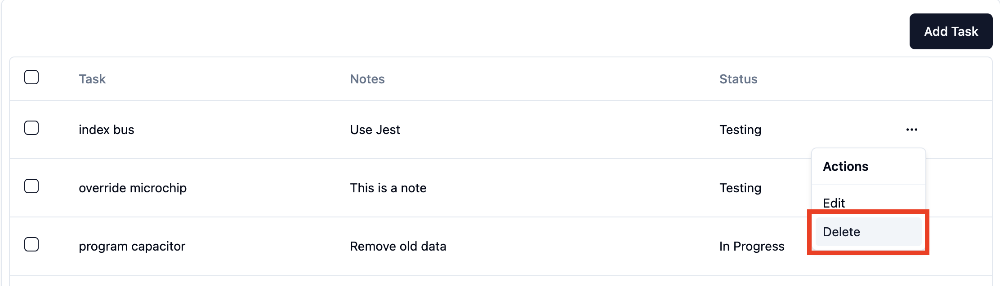
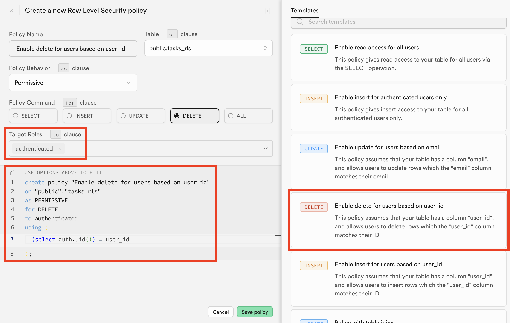
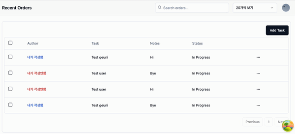

> [이전 글](https://geuni620.github.io/blog/2024/6/22/supabase-rls/)을 작성하고 나서 RLS를 적용하던 중, 의문이 생겼다.

<!-- 내용 추가해야함 -->

<br/>



RLS를 위 이미지처럼 적용해주려고 했다.

owner / authenticated / every는 각각 다음과 같다.

- owner: 본인이 작성한 글에만 접근 가능
- authenticated: 로그인한 유저에게만 접근 가능
- every: 모든 유저에게 접근 가능

<br/>

select / insert / update / delete는 각각 다음과 같다.

- select: 데이터 조회
- insert: 데이터 추가
- update: 데이터 수정
- delete: 데이터 삭제

즉, 로그인한 유저에게만 데이터 조회가 가능하고,  
데이터의 생성 / 수정 / 삭제는 본인의 글에만 가능하도록 하고 싶었다.

---

테스트해보자.



해당 버튼을 눌렀을 때, Toast 메시지를 띄우고 삭제를 해보자.

```TSX
// src/lib/table/columns.tsx
export const columns: ColumnDef<TaskProps>[] = [
  //...

  {
    id: 'actions',
    cell: ({ row }) => {
      const selectedTask = row.original;
      const deleteMutation = useTaskDeleteMutation();
      const onDelete = ({ id }: { id: string }) => {
        deleteMutation.mutate(id);
      };

      return (
        <DropdownMenu>
          <DropdownMenuTrigger asChild>
            <Button variant="ghost" className="size-8 p-0">
              <span className="sr-only">Open menu</span>
              <MoreHorizontal className="size-4" />
            </Button>
          </DropdownMenuTrigger>
          <DropdownMenuContent align="end">
            <DropdownMenuLabel>Actions</DropdownMenuLabel>
            <DropdownMenuSeparator />
            <DropdownMenuItem>Edit</DropdownMenuItem>
            <DropdownMenuItem onClick={() => onDelete({ id: selectedTask.id })}>
              Delete
            </DropdownMenuItem>
          </DropdownMenuContent>
        </DropdownMenu>
      );
    },
  },
];
```

Tanstack-table을 사용하고 있어서, `columns.tsx` 내 id action으로 DropdownMenu를 만들어주었다.

<br/>

```TSX
const deleteTask = async (id: string) => {
  const { error } = await supabase.from(TASK).delete().eq('id', id);

  if (error) {
    throw new Error(error.message);
  }

  return {
    message: '데이터를 성공적으로 삭제하였습니다.',
  };
};

export const useTaskDeleteMutation = () => {
  const queryClient = useQueryClient();

  return useMutation({
    mutationFn: deleteTask,
    onSuccess: ({ message }) => {
      queryClient.invalidateQueries({ queryKey: taskKeys.all });
      toast.success(message);
    },

    onError: (error) => {
      toast.error(error.message);
    },
  });
};
```

`useTaskDeleteMutation`을 만들어주었다.  
supabase의 DB 테이블 내, id와 동일한 데이터를 삭제해줄 것이다.

<br/>

### Delete RLS 적용

[이전 글에서](https://geuni620.github.io/blog/2024/6/22/supabase-rls/#3-row-level-security-%EC%A0%81%EC%9A%A9%ED%95%98%EA%B8%B0) RLS Select 적용방법은 작성해두었다.  
Delete도 적용해보자.



supabase에서 제공해주는 Delete Template에서 하나만 수정했는데,  
`to` 절에 `authenticated`를 추가해주었다.

```SQL
create policy "Enable delete for users based on user_id"
on "public"."tasks_rls"
as PERMISSIVE
for DELETE
to authenticated -- public → authenticated
using (
  (select auth.uid()) = user_id
);
```

이제 로그인한 사용자만 삭제 가능한지 확인해보자.

<br/>

하지만 위에서 언급했던 문제의 상황이 발생했다.  
삭제 문구는 정상적으로 동작하는데, 삭제가 되지 않는 것이다.

명확히 구분하기 위해 columns을 하나 더 추가해보았다.

```TSX
export const columns: ColumnDef<TaskProps>[] = [
 //...
  {
    accessorKey: 'author',
    header: 'Author',
    cell: ({ row }) => {
      const userId = row.original.userId;
      const { session } = useLogin();

      const isMyTask = session?.user?.id === userId;
      const authorText = isMyTask ? '내가 작성함' : '내가 작성안함';
      const textColor = isMyTask ? 'text-blue-600' : 'text-red-600';

      return <div className={`font-medium ${textColor}`}>{authorText}</div>;
    },
  },
  //...
];
```

내가 작성한 글일 경우, '내가 작성함'이라는 문구가 뜨도록 하였다.


