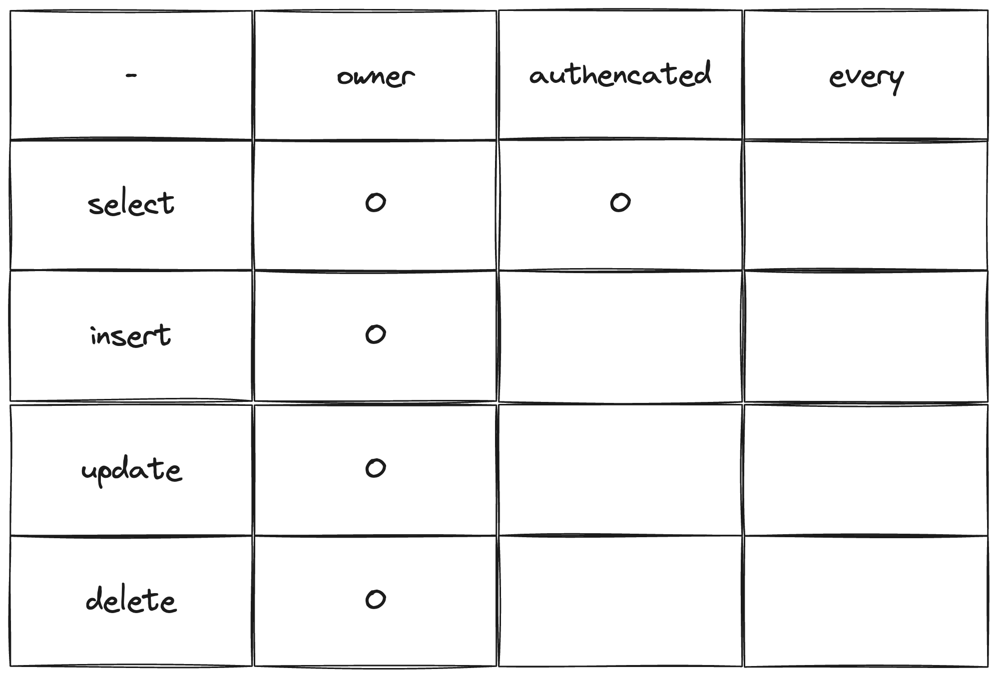
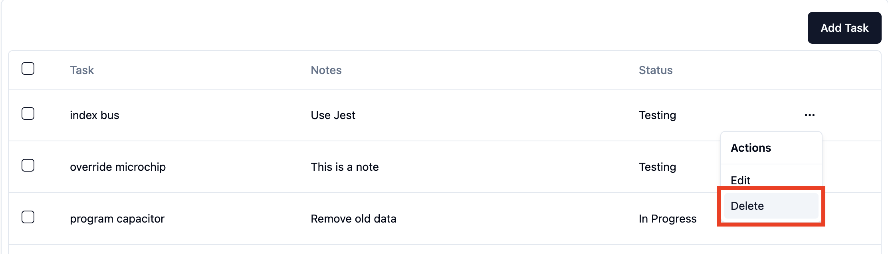
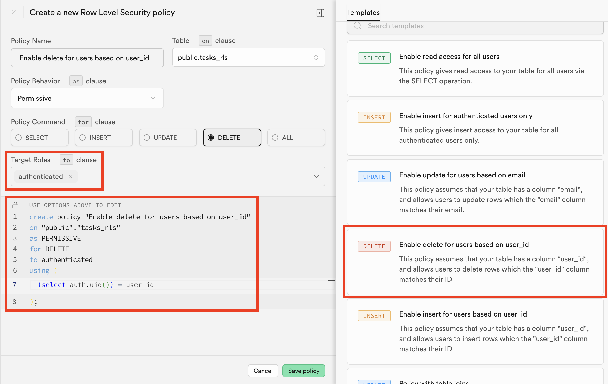
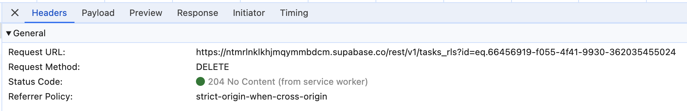
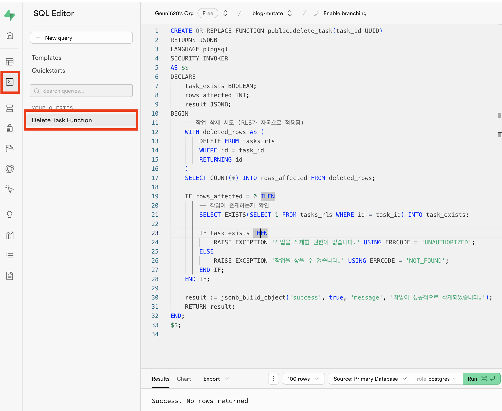
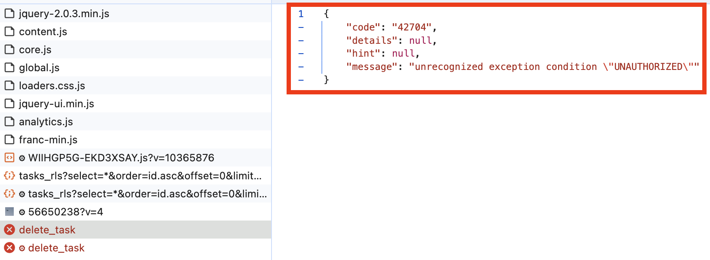

> [이전 글](https://geuni620.github.io/blog/2024/6/22/supabase-rls/)을 작성하고 나서 RLS를 적용하던 중, 의문이 생겼다.

<br/>

## 문제상황



RLS를 위 이미지처럼 적용해주려고 했다.

owner / authenticated / every는 각각 다음과 같다.

- owner: 본인이 작성한 글에만 접근 가능
- authenticated: 로그인한 유저에게만 접근 가능
- every: 모든 유저에게 접근 가능

<br/>

select / insert / update / delete는 각각 다음과 같다.

- select: 데이터 조회
- insert: 데이터 추가
- update: 데이터 수정
- delete: 데이터 삭제

즉, 로그인한 유저에게만 데이터 조회가 가능하고,  
데이터의 생성 / 수정 / 삭제는 본인의 글에만 가능하도록 하고 싶었다.

하지만, RLS를 적용하고 나서 **문제가 발생했다.**  
본인글에 대한 데이터는 정상적으로 삭제가 잘 된다.  
하지만 본인글이 아닌 경우 삭제는 불가능하지만,  
mutate의 **onSuccess 메서드 내 소스코드가 동작하는 것**이다.

---

## 재현하기

### UI & 비즈니스로직 구현

테스트해보자.



해당 버튼을 눌렀을 때, Toast 메시지를 띄우고 삭제를 해보자.

```TSX
// src/lib/table/columns.tsx
export const columns: ColumnDef<TaskProps>[] = [
  //...

  {
    id: 'actions',
    cell: ({ row }) => {
      const selectedTask = row.original;
      const deleteMutation = useTaskDeleteMutation();
      const onDelete = ({ id }: { id: string }) => {
        deleteMutation.mutate(id);
      };

      return (
        <DropdownMenu>
        // trigger
          <DropdownMenuTrigger asChild>
            <Button variant="ghost" className="size-8 p-0">
              <span className="sr-only">Open menu</span>
              <MoreHorizontal className="size-4" />
            </Button>
          </DropdownMenuTrigger>

          // content
          <DropdownMenuContent align="end">
            <DropdownMenuLabel>Actions</DropdownMenuLabel>
            <DropdownMenuSeparator />
            <DropdownMenuItem>Edit</DropdownMenuItem>
            <DropdownMenuItem onClick={() => onDelete({ id: selectedTask.id })}>
              Delete
            </DropdownMenuItem>
          </DropdownMenuContent>
        </DropdownMenu>
      );
    },
  },
];
```

Tanstack-table을 사용하고 있어서, `columns.tsx` 내 id action으로 DropdownMenu를 만들어주었다.

<br/>

```TSX
const deleteTask = async (id: string) => {
  const { error } = await supabase.from(TASK).delete().eq('id', id);

  if (error) {
    throw new Error(error.message);
  }

  return {
    message: '데이터를 성공적으로 삭제하였습니다.',
  };
};

export const useTaskDeleteMutation = () => {
  const queryClient = useQueryClient();

  return useMutation({
    mutationFn: deleteTask,
    onSuccess: ({ message }) => {
      queryClient.invalidateQueries({ queryKey: taskKeys.all });
      toast.success(message);
    },

    onError: (error) => {
      toast.error(error.message);
    },
  });
};
```

`useTaskDeleteMutation`을 만들어주었다.  
supabase의 DB 테이블 내, id와 동일한 데이터를 삭제해줄 것이다.

<br/>

### Delete RLS 적용

[이전 글에서](https://geuni620.github.io/blog/2024/6/22/supabase-rls/#3-row-level-security-%EC%A0%81%EC%9A%A9%ED%95%98%EA%B8%B0) RLS Select 적용방법은 작성해두었다.  
Delete도 적용해보자.



supabase에서 제공해주는 Delete Template에서 하나만 수정했는데,  
`to` 절에 `authenticated`를 추가해주었다.

```SQL
create policy "Enable delete for users based on user_id"
on "public"."tasks_rls"
as PERMISSIVE
for DELETE
to authenticated -- public → authenticated
using (
  (select auth.uid()) = user_id
);
```

이제 로그인한 사용자만 삭제 가능한지 확인해보자.

<br/>

하지만 위에서 언급했던 문제의 상황이 발생했다.  
삭제 문구는 정상적으로 동작하는데, 삭제가 되지 않는 것이다.

명확히 구분하기 위해 columns을 하나 더 추가해보았다.

```TSX
export const columns: ColumnDef<TaskProps>[] = [
 //...
  {
    accessorKey: 'author',
    header: 'Author',
    cell: ({ row }) => {
      const userId = row.original.userId;
      const { session } = useLogin();

      const isMyTask = session?.user?.id === userId;
      const authorText = isMyTask ? '내가 작성함' : '내가 작성안함';
      const textColor = isMyTask ? 'text-blue-600' : 'text-red-600';

      return <div className={`font-medium ${textColor}`}>{authorText}</div>;
    },
  },
  //...
];
```

내가 작성한 글일 경우, '내가 작성함'이라는 문구가 뜨도록 하였다.


위 GIF처럼, 내가 작성한 글(파란색)은 삭제가 되지만,  
내가 작성하지 않은 글(빨간색)은 삭제되지 않는다.  
하지만, 메시지는 여전히 `데이터를 성공적으로 삭제하였습니다.`가 떠서 혼란스럽다.

네트워크 탭을 열어서 확인해보면, 사실 아무것도 반환하지 않는다.



<br/>

## 원인분석

처음엔 버그라고 생각했다.  
supabase의 github issue에서 관련된 내용을 검색하다가 [이슈 하나](https://github.com/supabase/supabase-js/issues/902)를 발견했다.  
나와 동일한 문제를 경험한 것 같았고, [답변](https://github.com/supabase/supabase-js/issues/902#issuecomment-1824702735)에서 버그가 아닌 것을 확인했다.

<br/>

그럼 권한 없는 사람이 Delete 요청을 보내면, **적절한 메시지를 띄울 수 있는 방법은 없는 것일까..?**

<br/>

## 해결하기

Claude에게 해당 고민에 대해 질문했는데, 코드를 하나 짜주었다.

```SQL
CREATE OR REPLACE FUNCTION public.delete_task(task_id UUID)
RETURNS JSONB
LANGUAGE plpgsql
SECURITY INVOKER
AS $$
DECLARE
    task_exists BOOLEAN;
    rows_affected INT;
    result JSONB;
BEGIN
    -- 작업 삭제 시도 (RLS가 자동으로 적용됨)
    WITH deleted_rows AS (
        DELETE FROM tasks_rls
        WHERE id = task_id
        RETURNING id
    )
    SELECT COUNT(*) INTO rows_affected FROM deleted_rows;

    IF rows_affected = 0 THEN
        -- 작업이 존재하는지 확인
        SELECT EXISTS(SELECT 1 FROM tasks_rls WHERE id = task_id) INTO task_exists;

        IF task_exists THEN
            RAISE EXCEPTION '작업을 삭제할 권한이 없습니다.' USING ERRCODE = 'UNAUTHORIZED';
        ELSE
            RAISE EXCEPTION '작업을 찾을 수 없습니다.' USING ERRCODE = 'NOT_FOUND';
        END IF;
    END IF;

    result := jsonb_build_object('success', true, 'message', '작업이 성공적으로 삭제되었습니다.');
    RETURN result;
END;
$$;
```

SQL문법은 하나도 몰라서 검색을 좀 해봤는데, [Database Function](https://supabase.com/docs/guides/database/functions?language=js&queryGroups=example-view&example-view=data)이라는 것을 알게됐다.  
그리고 이를 통해 Postgres에 원하는 동작을 수행할 수 있다.

<br/>



위와 같이 붙여넣고 Run을 실행했을 때, Success가 뜨는 것을 확인했다.

<br/>

테스트 해보자.



권한이 없는 아이디로 삭제버튼을 클릭했을 때, 네트워크 탭에서 다음과 같은 Response를 내려준다.  
이를통해 클라이언트에서 적절히 Error 메시지를 띄워줄 수 있을 것이다.

<br/>

## 정리

사실 이게 **옳은 방법인지 잘 모르겠다.**  
RLS를 적용해보면서, 권한이 없는 유저가 해당 데이터를 삭제하려고 할 때,  
권한없음 에러가 내려오지 않는 것을 확인했고, 이를 RPC를 통해 해결해본 것이다.

한 가지 흥미로운 변화는, 내가 이 사례를 통해 SQL에 관심이 간다는 점이다.  
필요하지 않으면 학습하지 않았는데, 이번 계기로 SQL에 대해 조금 더 알아보고 싶어졌다.  
적어도, 위에서 Claude가 적어준 SQL문을 읽고 해석할 정도는 되어야할 것 같다. 😭

<br/>

### 참고자료

[error is always null if delete is not successful due to RLS policy #902](https://github.com/supabase/supabase-js/issues/902)  
[Database Functions](https://supabase.com/docs/guides/database/functions?language=js&queryGroups=example-view&example-view=data)
