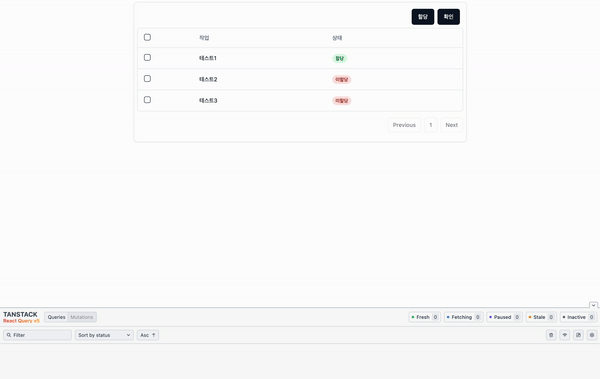
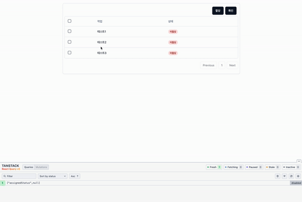

> 최근까지 회사의 기술적 난이도가 높지 않고, 똑같은 일만 반복해야하는 점에 불만이 있었는데,  
> **자만**이었다.

### 문제상황

오늘 간단히 해결할 수 있는 문제를 가지고 또 시간을 허비했다.  
대략 이러한 문제였다.

<br/>

- react-query로 데이터를 불러오고, 업데이트하는 Modal이 존재한다.
- Modal창을 닫으면, 레거시코드가 존재하고, 이곳에선 데이터를 useEffect를 통해 불러온다.
- Modal창에서 데이터가 업데이트되면, useEffect로 데이터를 불러오는 곳도 업데이트 되어야한다.
- 반대로, useEffect를 통해 데이터를 불러오는 곳을 업데이트한 뒤, Modal창을 열면 해당 데이터도 업데이트 되어야하는 것이다.

하지만 업데이트 되지 않았다.  
참고로 staleTime과 cacheTime은 각각 default이다. (0ms / 5min)

<br/>

'분명 업데이트 되어야 맞는데, 왜 업데이트 되지 않는걸까...'
시간이 급해서, 레거시 코드에서 데이터가 업데이트 되는 모든 이벤트의 마지막에 invalidateQueries를 설정해서 무효화시켰다.

그리고 퇴근 후 다시 해당 부분에 대해서 테스트를 진행해봤다.  
하지만 의문이 풀리지 않았다.

---

간단한 예시를 만들어봤다.



대시보드에서 보이는 데이터는 `useEffect`를 통해 가져온 데이터다.  
그리고, 체크박스 선택 후 모달창이 열렸을 때 가져오는 데이터는 `useQuery`를 통해 불러온다.

staleTime과 cacheTime은 각각 default로 0ms와 5min이다.  
refetchOnWindowFocus는 false로 꺼두었다.  
그 외 다른 모든 설정은 default이다.  
하지만, 재현이 되지 않는다.

일단 여기까지 정리해보면,  
회사에서 '분명 업데이트 되어야 맞는데'라고 생각했던 게 맞았다.

staleTime이 0ms로 데이터를 불러오자마자 낡은 데이터로 취급된다.  
그럼 대시보드에서 데이터를 변경하지 전 모달창을 열어서 데이터를 캐싱해놓았더라도,  
모달창을 닫은 후 대시보드에서 데이터를 변경 → 같은 행을 선택 후 모달창을 열었을 때, 새롭게 데이터를 불러와야한다.  
하지만 회사에서 맞닥드렸던 문제는 isFetching이 계속 false 상태였고, 데이터를 새롭게 불러오지 않았다.

---

### 원인발견

시간이 많이 지나 원인을 발견했다.

이 문제의 주요 원인은 `useGetAssignedStatus` 훅을 `StatusChangeConfirmModal` 컴포넌트 내부가 아닌 바깥에서 선언했기 때문이다.  
그로 인해 **마운트와 언마운트 트리거가 정상적으로 동작하지 않았다.**

[예시코드](https://github.com/Geuni620/staletime-isfetching)

```TSX
export function Dashboard() {
  //...

  const status = useGetAssignedStatus({ id: selectedId });

  // ...
  useEffect(() => {
    const selectedId = Object.keys(rowSelection).at(0);
    if (selectedId) {
      setSelectedId(selectedId);
    }
  });

  return (
    <div className="rounded-lg border p-2 shadow-sm">
      <div className="flex w-full items-center justify-end gap-2 p-2">
        <Button
          onClick={() => {
            onAssignStatusChange(Object.keys(rowSelection), 'assigned');
          }}
        >
          할당
        </Button>

        <Button
          onClick={() => {
            setIsModalOpen((prev) => !prev);
          }}
        >
          확인
        </Button>
      </div>
      <DataTable
        rowSelection={rowSelection}
        onRowSelectionChange={onRowSelectionChange}
        data={tasks || []}
        total={totalCount ?? 0}
        columns={columns}
        pagination={pagination}
        onPaginationChange={onPaginationChange}
      />

    // useGetAssignedStatus를 Modal 내부에서 선언하지 않으면,
    // 데이터가 갱신될 때마다 트리거되지 않음.
      {isModalOpen && status.isLoading === false && (
        <StatusChangeConfirmModal
          id={selectedId ?? ''}
          isOpen={isModalOpen}
          onClose={() => {
            setIsModalOpen(false);
            resetRowSelection();
          }}
        />
      )}
    </div>
  );
}
```

만약 StatusChangeConfirmModal내부에서 useGetAssignedStatus를 선언 후 사용했다면,  
모달창이 마운트되고, 언마운트 될 때마다 isFetching이 true로 변경됐을 것이고, 문제가 발생하지 않았을 것이다.

아래 동일한 상황을 재현해보았다.



영상을 보면, 한 개씩 클릭해서 체크박스 선택 후 모달창이 열렸을 때 가져오는 데이터를 캐싱해준다.  
그리고, 테스트1을 체크한 뒤 할당버튼을 클릭했다.  
마지막으로 테스트1을 체크한 뒤 확인을 클릭하면, 미할당 상태로 남아있는 것을 볼 수 있다.

영상 하단에 devTools를 살펴보면, 모달창이 열리고 닫힐 때 query가 inactive상태가 되지 않는 것을 확인할 수 있다.

<br/>

### 느낀 점

이 말을 어떻게 써야할 지 모르겠는데, 대략 이런 상황이다.

예시를 만들고 나서, '이제는 재현되겠지?' 했지만, 계속 재현이 되지 않았다.  
문제를 잘못 짚고 있었던 것이다.

우여곡절 끝에 원인을 발견했을 때, **기분이 좋으면서도 한편으로 겁이났다.**  
예시코드를 만들면서 개발할 땐, StatusChangeConfirmModal 컴포넌트 내에 usegetAssignedStatus hook을 선언했기 때문이다.  
하지만 회사에선 대체. 왜. 잘못된 방향으로 개발했던 걸까?

<br/>

두 가지가 떠오르는데, 다음과 같다.

회사에선 레거시코드가 존재한다.  
이는 JS기반으로 되어있고, Container, Presenter 패턴을 사용한다.  
Container에 비즈니스로직이, Presenter에 뷰로직이 적혀있는데, 각각 대략 2000줄씩 되는 것 같다.  
Container에 컴포넌트는 Presenter 딱 1개 존재한다.  
Presenter는 atom 컴포넌트들로 구성되어있지만, 중복된 코드 및 분리가 전혀 되어있지 않다.

**나는 최대한 레거시코드는 건드리지 않고**, 새롭게 만드는 프로젝트를 진행하려 했다.  
그러다보니, 기존 코드는 유지한 상태로 필요한 것을 하나씩 끼워넣으려고 했고,  
결국 위와 같은 문제에 봉착하게 됐다.  
즉, 기존 문제를 해결하지 않은 채 새로운 것을 만들어 넣다보니, 전체적으로 더 복잡해진 상황이 된 것이다.

다른 하나는, 회사에서 Aui Grid라는 라이브러리를 사용한다.  
특이한게, 테이블 행의 데이터를 빼오려면, useEffect를 사용해서 이벤트를 등록한다.  
그래서, 위 예시코드에 useEffect로 selected 된 데이터를 setState 한 것이다.

```TSX
  useEffect(() => {
    const selectedId = Object.keys(rowSelection).at(0);
    if (selectedId) {
      setSelectedId(selectedId);
    }
  });
```

이 점이 참 마음에 들지 않는다. 다른 방법이 있을 것 같은데, 아직은 잘 모르겠다.  
아무리 찾아봐도, 이벤트 등록을 이렇게 밖에 못하는 것 같다.  
결국 이 또한, 스노우볼이 굴러갔다고 생각한다.

내 판단에 어색하거나, 이상한 코드가 눈에 보이면 대체로 넘어갔었는데 살펴보고 디버깅해야할 것 같다.  
사실 위 코드는 tanstack-table이었다면, rowSelection이 알아서 해결해준다.
굳이 useEffect를 사용하지 않아도 되는 것이다.

---

<br/>

마지막으로,  
완전 자만했다. 잘하고 있다고 생각했는데 기본적인 것도 모르는 바보였다.  
~~다시 자만이 찾아오면 읽어보기로하자.~~
