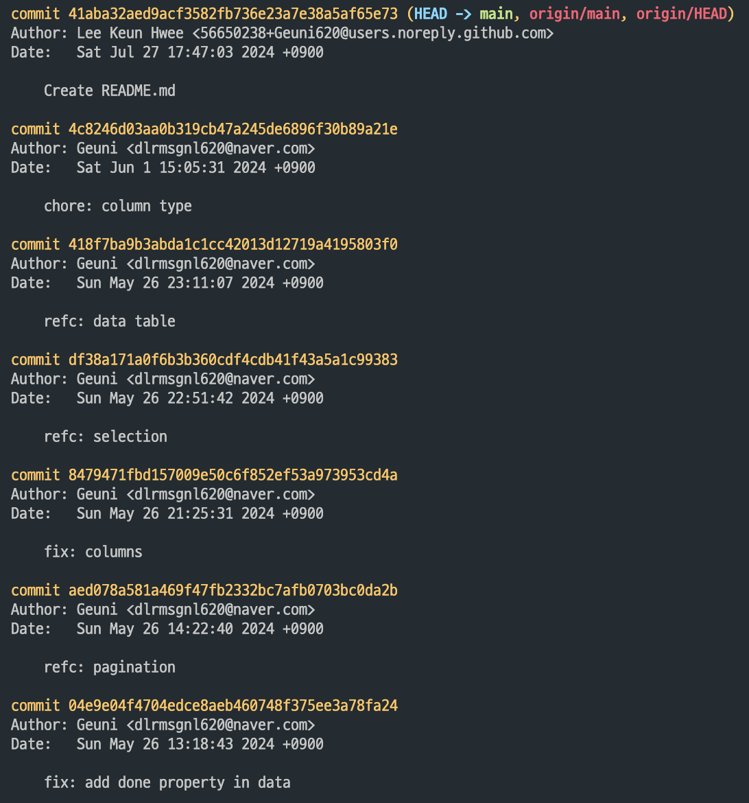
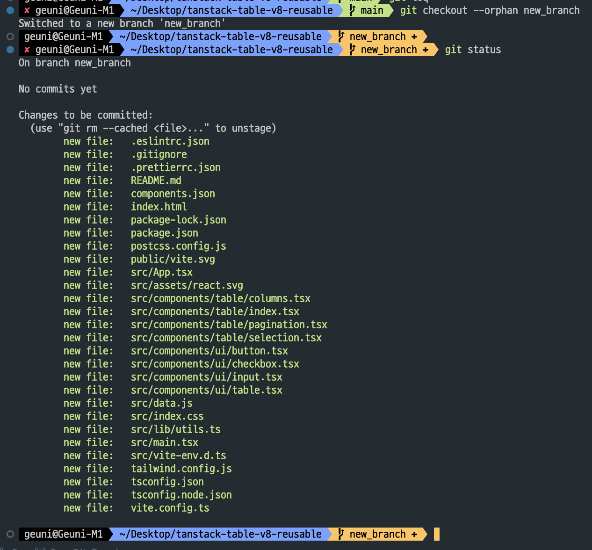
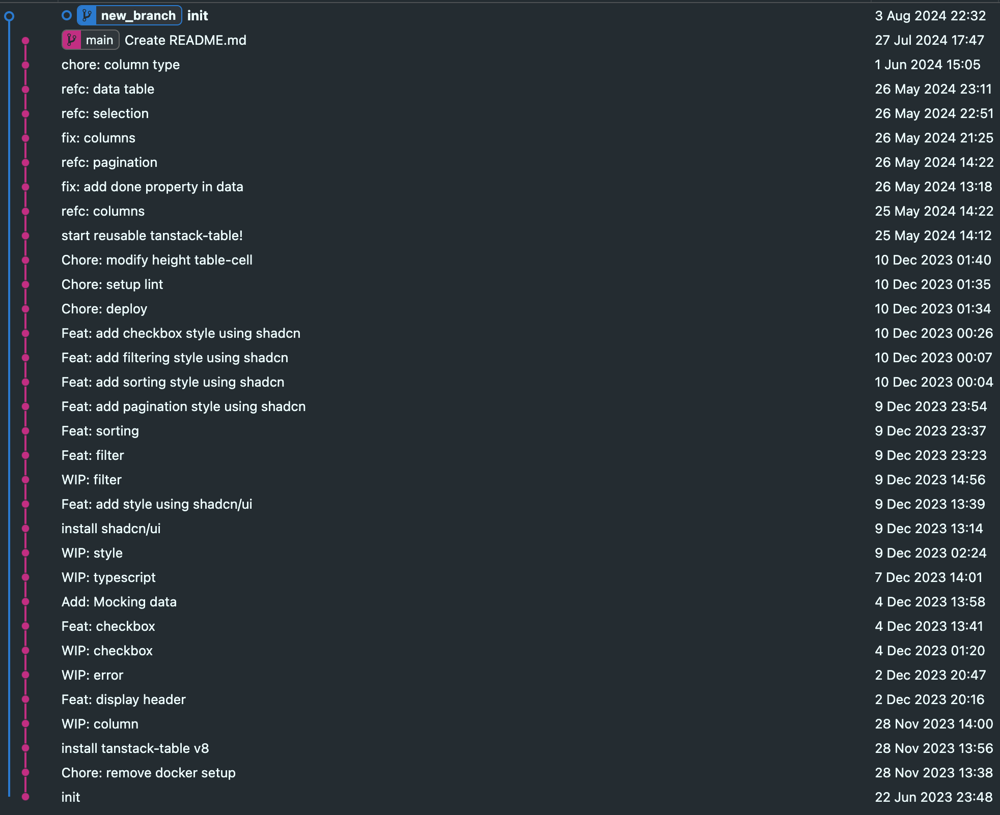
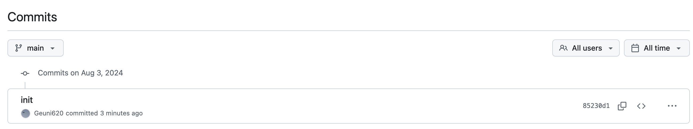

보통 글을 쓸 때, 예시를 만들어보는 편이다.  
동일한 기능이라도, 최대한 다시 만들어보고 이전과 비교해보면서 성장해야할 때도 있지만,  
때론 한정된 시간 내에서 예시도 만들고, 글의 퀄리티도 높이고 싶을 때가 있다.

오늘이 딱 그랬다.  
보통은 다음과 같이 진행했다.

> 이전 글을 위해 만들어놓은 예시 레포를 Clone  
> → 새롭게 레포를 생성  
> → 이전 레포의 의존성 끊기(git remove remove origin)  
> → 새롭게 만든 레포로 연결(git add origin url)

이 방법도 좋지만, 한 가지 아쉬운 점은, **기존에 만들어 놓은 예시의 git log가 그대로 올라간다는 점**이다.  
새롭게 만든 레포에는, 이전 기록은 모두 제거한 상태로, init으로 시작을 알리고 싶다.

<br/>

---

이전 레포의 의존성을 끊은 뒤, 추가적인 몇 가지 작업을 하면 log를 reset 시킬 수 있다.

```
git remote remove origin
git checkout --orphan new_branch
git add .
git commit -m "init"
git branch -D main
git branch -m main
```

이렇게 진행하면, 해당 로그를 깔끔하게 정리할 수 있었다.
한 번 해보자.

<br/>



먼저 예시로 이전에 작업했던 레포를 클론받은 뒤 log를 캡처해본 것이다.


여기서 `git checkout --orphan new_branch`까지 작업하면 다음과 같다.  
특이점은, `git status`로 상태를 확인 했을 때,  
기존에 tracking 되고 있던 파일들이 모두 새롭게 staging area로 올라온다는 점이다.



여기서 --orphan으로 checkout 했을 때, 레포의 브랜치, 커밋을 모두 끊어내고, 새로운 커밋기록을 생성한다.  
이후에 main 브랜치를 제거하고, new_branch를 main 브랜치로 변경해준 뒤 commit으로 올린다.



깔끔하게, log 기록이 제거된 것을 확인할 수 있다.

<br/>

이제 글을 쓸 때, 이전 커밋을 리셋한 뒤,  
해당 글에 필요한 커밋기록만 남길 수 있게 되었다! 🍀
