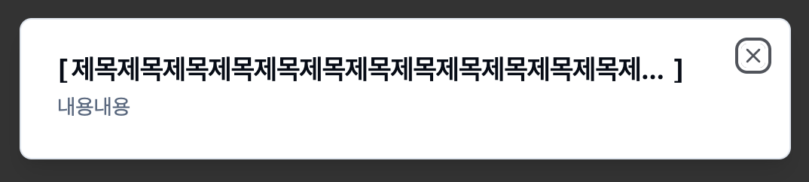

요구사항이 다음과 같다고 가정해보자.

1. 모달창 가로길이 내 제목을 추가해야한다.
2. 제목은 한 줄로만 표기되어야한다.
3. 제목을 구분할 수 있게 앞, 뒤로 대괄호`[]`가 추가되어야한다.
4. 제목의 길이가 모달창 가로길이보다 길 경우, 제목 뒤 짤리는 부분은 `...`으로 표기되어야한다.  
   (제목길이 > 모달창 가로길이)

<br/>

간단하다고 생각했는데, 어려웠다.

```TSX
// App.tsx
export const App = () => {
  return (
    <main className="w-screen h-screen flex justify-center items-center">
      <Dialog>
        <DialogTrigger>Open</DialogTrigger>
        <DialogContent>
          <DialogHeader>
            <DialogTitle className="title">
              [제목제목제목제목제목제목제목제목제목제목제목제목제목제목제목제목]
            </DialogTitle>
            <DialogDescription>내용내용</DialogDescription>
          </DialogHeader>
        </DialogContent>
      </Dialog>
    </main>
  );
};
```

```CSS
.title {
  width: 90%;
  overflow: hidden;
  text-overflow: ellipsis;
  white-space: nowrap;
}
```


다음과 구성하면, 보기 좋기 실패한다.  
대괄호 뒷 부분이 `...`에 묻혀버리기 때문이다.

<br/>

그래서 [before](https://developer.mozilla.org/en-US/docs/Web/CSS/::before), [after](https://developer.mozilla.org/ko/docs/Web/CSS/::after)를 써보기로 했다.

```CSS
.title {
  width: 90%;
  overflow: hidden;
  text-overflow: ellipsis;
  white-space: nowrap;

  position: relative;
  padding: 0 5px;
}

.title::before,
.title::after {
  position: absolute;
}

.title::before {
  content: "[";
  left: 0;
}

.title::after {
  content: "]";
  right: 0;
}
```


App.tsx에 있던 대괄호를 제거하고  
CSS 가상요소(before, after)를 사용하여 대괄호를 추가했다.  
잘 된 것처럼 보이지만, 만약 제목이 짧다면 어떻게 될까?

<br/>


제목이 짧을 경우, 대응하지 못한다.

<br/>

영역을 나누는 것이 더 좋다.  
부모는 width만 처리하고, 자식은 그 width를 넘어가면 `...`만 표기,  
그리고 자식의 가상요소는 대괄호만 표기해보자.

```TSX
export const App = () => {
  return (
    <main className="w-screen h-screen flex justify-center items-center">
      <Dialog>
        <DialogTrigger>Open</DialogTrigger>
        <DialogContent>
          <DialogHeader>
            <DialogTitle className="title">
              <span className="text">
                제목제목제목제목제목제목제목제목제목제목제목제목제목제목
              </span>
            </DialogTitle>
            <DialogDescription>내용내용</DialogDescription>
          </DialogHeader>
        </DialogContent>
      </Dialog>
    </main>
  );
};
```

```diff
.title {
- width: 90%;
- text-overflow: ellipsis;
- padding: 0 5px;
+ max-width: 90%
+ display: flex;
+ align-items: center;
  overflow: hidden;
  white-space: nowrap;
  position: relative;
}

- .title::before,
- .title::after {
-   position: absolute;
- }

.title::before {
  content: "[";
- left: 0;
}

.title::after {
  content: "]";
- right: 0;
}

+ .text {
+   overflow: hidden;
+   text-overflow: ellipsis;
+   padding: 0px 3px;
+ }
```

span을 추가하고, CSS를 수정했다.  
먼저, absolute를 제거해줬다.  
왼쪽과 오른쪽에 각각 고정되어있던 left와 right를 풀어주었다.

고정이던 width값을 제거하고, max-width 90%를 추가했다.  
즉, 부모 width의 최대 90%까지만 width가 지정될 것이다.

display: flex를 추가해서, 부모 요소의 전체 너비에서 제목 내용물 너비에 맞게 조절해주었다.

`.title`에 지정되어있던, overflow, text-overflow, padding은 `.text`로 옮겨주었다.




이제 텍스트의 길이에 따라 유연하게 대응할 수 있다.
