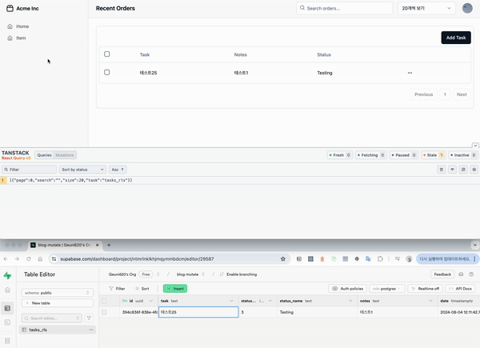

> 얼마 전 회사에서, 작은 경험을 했는데, 어디 남겨 놓을까 하다가  
> 결국 블로그에 쓰게됐다.

먼저 간단한 테스트해보았다.  
만약 이런 경우라면 어떻게 되는걸까?

1.  queryKey에 해당하는 데이터가 cacheTime 내 존재한다.
2.  다른 페이지로 이동 `/home → /details`
3.  cacheTime 내 다시 해당 페이지로 접속 `/details → /home`

 

이때 isLoading과 isFetching은 각각 어떻게 되는 것일까?  
그리고, 만약 cacheTime 내 다시 해당 페이지로 접속했을 때,  
외부환경에 의해 DB의 데이터가 변경됐다면, 3의 데이터는 변경된 데이터를 노출할까?

 

간단한 예시를 만들어봤고, 테스트해봤다.  
cacheTime와 staleTime 각각 default 값을 사용했다. (5min, 0s)  
결과는 다음과 같다.

> 3.에서 isLoading과 isFetching은 각각 어떻게 되는 것일까?

**isLoading은 false를, isFetching은 true를 반환할 것이다.**  
isLoading은 캐싱된 데이터가 없고, queryKey에 해당하는 첫 데이터를 가져올 때, **true**가 된다.  
1에서 캐싱된 데이터가 존재한다고 했으니, false를 반환한다.

isFetching은, staleTime이 만료되었으면, 캐싱된 데이터가 존재하더라도, **true**이다.
3으로 이동했을 때, staleTime이 만료된 이후이기에, true를 반환할 것이다.

여기서, 캐싱된 데이터라고 언급한 것은 모두 cacheTime이 만료되지 않은 상태의 데이터이다.

 

> 만약 cacheTime 내 다시 해당 페이지로 접속했을 때,  
> 외부환경에 의해 DB의 데이터가 변경됐다면, 3.의 데이터는 변경된 데이터를 노출할까?

1, 2의 과정을 거쳤고, 3의 과정을 수행하기 전, DB의 데이터가 변경됐다.  
그리고, 3.의 과정을 수행했다.

그럼 isLoading은 여전히 false이다. 하지만 isFetching은 true가 된다.  
만약, isLoading을 통해 스켈레톤UI 작업을 해놓았다면, 스켈레톤 UI는 보이지 않는다.

하지만, isFetching이 true이기 때문에, 페이지에 접속했을 땐, cacheTime이 만료 전이라, 캐싱된 데이터를 노출하고,  
isFetching이 true → false로 변경될 때, 새롭게 불러온 신선한 데이터로 변경될 것이다.

 

> 만약, staleTime을 0ms → 5min으로 변경했을 때, 3.의 데이터는 변경된 데이터를 노출할까?

노출하지 않는다. staleTime이 만료되기 전이라, isLoading, isFetching 모두 false이고,  
3.의 데이터 역시 stale한 데이터(변경되기 전)를 노출한다.

 

---

그럼 회사에서 겪었던 문제는 무엇이었을까?

출고에 관련된 데이터를 검색하기 위해선, 해당 화주사 리스트가 필요하다.  
이 리스트를 기존에는 클라이언트 상태로 관리하다가, 서버상태로 변경했다.  
그리고, 이 서버상태를 가지고 API를 호출한다.

이때, 출고에 관련된 API를 쏘기 전, 화주사 리스트나 isLoading 상태인지 검증하고,
isLoading이 false일 경우, API를 호출하도록 해줬다.

근데 문제가 발생했다.  
센터를 고려하지 못했던 것이다.

A유저가 A센터로 로그인  
\> 출고에 관련된 데이터를 호출  
\> 로그아웃 후 로그인 페이지로 이동

A유저가 B센터로 로그인  
\> 출고에 관련된 데이터 호출

- 이때 호출된 데이터는 화주사리스트에 isLoading fasle이고, isFetching은 true이다.
- isLoading이 fasle 이니, 캐싱된 데이터를 사용해서 API를 쏜다. (A센터 화주리스트로 API를 호출함)
- isFetching은 true이니, 변경된 화주사 리스트로도 API를 다시 호출한다. (레거시 코드라 API 호출은 일부 useEffect로 호출함)
- 그리고 setState 과정에서, 변경된 화주사 리스트로 업데이트 했다가, isFetching이 true가 되는 현상이후, 다시 기존 데이터로 setState 해버린다.
- 명확히 원인을 파악하지 못했다. 예상은 isLoading 했던 부분을 isFetching으로 변경하니 잘 적용된다는 점이다.
