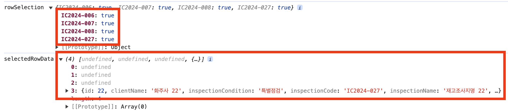

[이전 글에서도 언급했지만](https://geuni620.github.io/blog/2024/6/7/tanstack-table-server-side/), Tanstack-table을 페이지네이션을 client-side와 server-side 모두 적용할 수 있다.

server-side를 알게 된 이후, 최근까진 Tanstack-table을 사용해야할 경우 모두 server-side로 구현했다.  
일단, 서버에 의존적이라는게 나는 오히려 좋았다.  
자주 요청을 보내더라도, 보여줘야할 양 만큼만 가져오는게 마음에 든다.  
하지만 이번에 새롭게 배포한 기능에선 예상지 못한 이슈가 발생했는데, 다음과 같다.



1. 1페이지에서 원하는 데이터를 체크박스에 체크했다.
2. 다른 페이지에서 데이터를 선택하기 위해, 페이지를 이동했다. 2페이지로 갔다고 가정해보자
3. 2페이지에서 원하는 데이터를 선택했다.

그리고 확인을 누르면, 1페이지에서 선택한 데이터가 유지되지 않는 것이다.  
페이지네이션 역시 서버에 의존하고 있어서, 2페이지로 이동했을 때, 1페이지의 데이터가 유지되지 않는 것이다.

<br/>

Tanstack-table을 사용했을 때, 크게 두 가지 방법이 있는 것 같다.  
첫 번째는, useReactTable의 onRowSelectionChange 메서드에 custom한 함수를 등록하는 방법,
두 번째는, rowSelection에 따라 useEffect로 데이터를 동기화시키는 것이다.

사실 처음 봤을 땐, 첫 번째가 더 나은 방법이라는 생각도 들지만,
확실히 간단하고 '동기화'라는 개념으로 봤을 때, 두 번째도 절-대 나쁜 코드라고 생각되지 않는다.

각각 살펴보자.

<br/>

### 1. onRowSelectionChange

```TSX

```

### 2. rowSelection → useEffect

```TSX
export const DataTable = <TData, TValue>({
  data,
  columns,
  total,
  pagination,
  onPaginationChange,
  getRowId,
}: DataTableProps<TData, TValue>) => {
  const [rowSelection, setRowSelection] = useState<RowSelectionState>({});
  const [selectedRowData, setSelectionRowData] = useState<InventoryInspectionResponse['data']>([]);

  const table = useReactTable({
    data,
    columns,
    getCoreRowModel: getCoreRowModel(),
    manualPagination: true,
    rowCount: total,
    onPaginationChange,
    onRowSelectionChange: setRowSelection,
    state: { pagination, rowSelection },
    getRowId,
  });

  useEffect(() => {
    const handleSelectionState = (selections: RowSelectionState) => {
      setSelectionRowData((prev) =>
        Object.keys(selections)
          .map(
            (key) =>
              table.getSelectedRowModel().rowsById[key]?.original ||
              prev.find((row) => row.inspectionCode === key),
          )
      );
    };

    handleSelectionState(rowSelection);
  }, [rowSelection]);

  return (
    // ...
  );
};
```

server-side가 아니라, client-side로 구성했다면,

```TSX
table.getSelectedRowModal().flatRows.map((row) => row.original)
```
