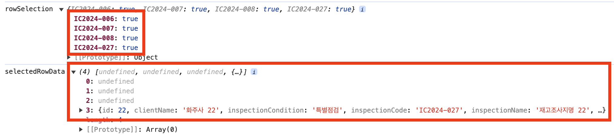

[이전 글에서도 언급했지만](https://geuni620.github.io/blog/2024/6/7/tanstack-table-server-side/), Tanstack-table을 페이지네이션을 client-side와 server-side 모두 적용할 수 있다.  
server-side를 알게 된 이후, 최근까진 Tanstack-table을 사용해야할 경우 모두 server-side로 구현했다.

일단, 서버에 의존적이라는게 나는 오히려 좋았다.  
자주 요청을 보내더라도, 보여줘야할 양 만큼만 가져오는게 마음에 든다.  
하지만 이번에 새롭게 배포한 기능에선 예상지 못한 이슈가 발생했는데, 다음과 같다.



1. 1페이지에서 원하는 데이터를 체크박스에 체크했다.
2. 다른 페이지에서 데이터를 선택하기 위해, 페이지를 이동했다. 2페이지로 갔다고 가정해보자
3. 2페이지에서 원하는 데이터를 선택했다.

그리고 확인을 누르면, 1페이지에서 선택한 데이터가 유지되지 않는 것이다.

페이지네이션이 서버에 의존하고 있어서,  
1페이지에서 2페이지로 넘어갔을 때, 2페이지에 해당 하는 양만큼 새롭게 데이터를 불러오고,  
이때 1페이지에서 선택한 데이터는 날아가버린다.

<br/>

**어떻게하면 페이지네이션 변경에 따라 데이터를 유지시킬 수 있을까?**

Tanstack-table을 사용했을 때, 크게 두 가지 방법이 있는 것 같다.  
**첫 번째는**, useReactTable의 `onRowSelectionChange` 메서드에 custom한 함수를 등록하는 방법,  
**두 번째는**, rowSelection에 따라 useEffect로 데이터를 동기화시키는 것이다.

각각 살펴보자.

<br/>

### 1. onRowSelectionChange

```TSX
export const DataTable = <TData, TValue>({
  data,
  columns,
  total,
  pagination,
  onPaginationChange,
}: DataTableProps<TData, TValue>) => {
  const [rowSelection, setRowSelection] = useState<RowSelectionState>({});
  const [selectedRowData, setSelectedRowData] = useState<TData[]>([]);

  const onRowSelectionChangeHandler: OnChangeFn<RowSelectionState> = (
    updaterOrValue: Updater<RowSelectionState>,
  ) => {
    const updateRowSelection =
      typeof updaterOrValue === 'function'
        ? updaterOrValue(rowSelection)
        : updaterOrValue;

    setRowSelection(updateRowSelection);

    const selectedRows = Object.entries(updateRowSelection).reduce(
      (acc, [key, isSelected]) => {
        if (isSelected) {
          const index = Number(key);
          acc.push(data[index]);
        }
        return acc;
      },
      [] as TData[],
    );

    setSelectedRowData(selectedRows);
  };

  const table = useReactTable({
    data,
    columns,
    getCoreRowModel: getCoreRowModel(),
    manualPagination: true,
    rowCount: total,
    onPaginationChange,
    onRowSelectionChange: onRowSelectionChangeHandler,  // here 🙋‍♂️
    state: { pagination, rowSelection },
  });

  return (
    // ...
  );
};
```

[Tanstack-table에서 체크박스를 관리할 수 있는 별도의 기능을 제공해주는데](https://tanstack.com/table/v8/docs/guide/row-selection#manage-row-selection-state) rowSelection을 이용하는 것이다.

rowSelection state를 생성하고 onRowSelectionChange메서드에 setRowSelection을 등록하면,  
체크박스를 체크할 때마다 rowSelection 상태가 업데이트된다.

이를 custom해서, onRowSelectionChangeHandler를 만들었다.  
rowSelection도 업데이트하면서, 체크된 rowSelection에 해당하는 행 데이터도 selectedRowData에 담아준다.

<br/>

**만약 getRowId를 설정했다면 조금 변경이 필요하다.**  
[어떠한 getRowId도 설정하지 않은 상태라면, Tanstack-table에선, rowId를 index값으로 사용한다.](https://tanstack.com/table/latest/docs/api/core/table#getrowid)

페이지 1에서 두 번째, 세 번째 체크박스를 체크하고, 2페이지로 이동했을 때, rowId가 설정되지 않았다면,  
해당 2페이지에서도 두 번째, 세 번째 체크박스 데이터는 1페이지에서와 동일한 rowId를 가지게 된다.


<br/>

```TSX
  const onRowSelectionChangeHandler: OnChangeFn<RowSelectionState> = (
    updaterOrValue: Updater<RowSelectionState>,
  ) => {
    const updateRowSelection =
      typeof updaterOrValue === 'function'
        ? updaterOrValue(rowSelection)
        : updaterOrValue;

    setRowSelection(updateRowSelection);

    const selectedRows = Object.entries(updateRowSelection).reduce(
      (acc, [key, isSelected]) => {
        if (isSelected) {
          const rowIndex = data.findIndex((row) => row.inspectionCode === key); // rowIndex를 찾아서 넣어줌
          const index = Number(rowIndex);
          acc.push(data[index]);
        }
        return acc;
      },
      [] as TData[],
    );

    setSelectedRowData(selectedRows);
  };

  const table = useReactTable({
    data,
    columns,
    getCoreRowModel: getCoreRowModel(),
    manualPagination: true,
    rowCount: total,
    onPaginationChange,
    onRowSelectionChange: onRowSelectionChangeHandler,
    state: { pagination, rowSelection },
    getRowId, // props로 getRowId 추가
  });
```

getRowId를 추가했다면, rowIndex를 찾아서, 그에 맞는 rowIndex를 넣어주면 된다.  
getRowId를 custom하게 만들지 않고, useReactTable에 주입하는 data의 key값과 동일하다면, filter를 써도 된다.

```TSX
const onRowSelectionChangeHandler: OnChangeFn<RowSelectionState> = (
    updaterOrValue: Updater<RowSelectionState>,
  ) => {
    //...

    const selectedRows = data.filter(
      (row) => updateRowSelection[row.inspectionCode],
    );

    setSelectedRowData(selectedRows);
  };
```

<br/>

### 2. rowSelection → useEffect

```TSX
export const DataTable = <TData, TValue>({
  data,
  columns,
  total,
  pagination,
  onPaginationChange,
  getRowId,
}: DataTableProps<TData, TValue>) => {
  const [rowSelection, setRowSelection] = useState<RowSelectionState>({});
  const [selectedRowData, setSelectionRowData] = useState<InventoryInspectionResponse['data']>([]);

  const table = useReactTable({
    data,
    columns,
    getCoreRowModel: getCoreRowModel(),
    manualPagination: true,
    rowCount: total,
    onPaginationChange,
    onRowSelectionChange: setRowSelection,
    state: { pagination, rowSelection },
    getRowId,
  });

  useEffect(() => {
    const handleSelectionState = (selections: RowSelectionState) => {
      setSelectionRowData((prev) =>
        Object.keys(selections)
          .map(
            (key) =>
              table.getSelectedRowModel().rowsById[key]?.original ||
              prev.find((row) => row.inspectionCode === key),
          )
      );
    };

    handleSelectionState(rowSelection);
  }, [rowSelection]);

  return (
    // ...
  );
};
```

useEffect는 rowSelection을 기반으로 selectedRowData를 동기화시켜주는 것이다.  
간단하면서 쉬운 방법이라고 생각된다.

<br/>

### 정리

두 가지 방법 중 어떠한 방법을 사용할 지는 아직 미정이다.  
상황과 경우에 따라 다르겠지만, 나는 최대한 useEffect를 지양한다.

그래서 첫 번째 방법을 고려해본 뒤, 복잡도가 너무 높아지고, 공통으로 작성된 Tanstack-table의 수정이 많아진다면,  
두 번째 방법을 사용할 것 같다.

<br/>

### 참고자료

[get access to selected row data from outside table component #2155](https://github.com/TanStack/table/discussions/2155#discussioncomment-10056182)
