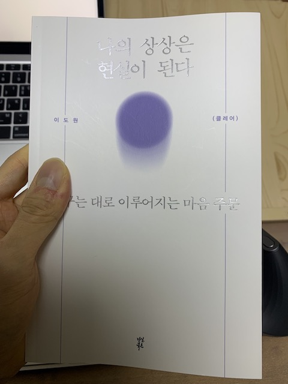

최근 들어 책을 읽기 시작했다. 책을 읽으며 가장 얻고자 했던 것은 '동기'이다.
세상 사람들에게 태어나자마자 가장 공평하게 주어지는 것은 시간이 아닐까?
당연하게 주어진 시간을 보내는 사람이 있는 반면, 치열하게 시간을 쪼게가며 살아가는 이들이 있다. 이 책의 저자가 그렇다. 엄마이자, 작가이자, 의대생.

초등학교 때부터 친하게 지낸 친구가 있다. 재수를 해서 원하던 의대에 입학했다. 사람들의 부러움을 뒤로한채 그 친구는 레지던트를 시작하기 전 미국의사를 준비했다. 결과적으론 긍정적이었지만, 그 친구는 돌연 레지던트를 다시 시작하기로 했다는 소식을 최근에 들었다. 누군가는 의사라는 부러움도 잠시, 시간을 낭비했다고, 왜 그런 선택을 했냐고, 그 친구에게 화살을 날릴 수도 있다. 하지만 해보고 싶은 일을 도전하고, 후회 없이 해봤다면 그 뒤에 더 나은 미래를 그릴 수 있지 않을까라는 생각이 든다. 이 책의 저자가 말하듯 "쓸모없는 공부는 없다."

회사를 관두고 1년간 공공기관을 준비했다. 관두기전 하고 싶은 일 두 가지 중 그나마 확률이 높은 일에 나의 시간을 투자했다. 준비한지 1년이 지났을 무렵, 한 공공기관에 필기를 응시했고, 전혀 기대없이 쳤던 시험에 필기합격이라는 메일을 받았다. 하지만 그 다음 날 참석이 힘들 것 같다는 메일을 보냈다. 이미 내 마음엔 다른 한 가지의 꿈이 너무 커져버린 뒤였다.

> "처음 뭔가를 결심하고 하신다면 정말 자기가 생각해도 하찮다고 생각할 정도의 계획을 세워 시작하십시오"

최근 시청한 '체인지 그라운드' 영상에서 나온 말이다.
아직 많은 책을 읽진 않았지만 일본전산이야기, 체인지 그라운드 영상, 나의 상상은 현실이된다 의 공통점은 작은 성공을 성취하라는 점이다.
그런 점에서 내가 이루고 싶은 세 가지 성취는 다음과 같다.

[ ] 건강을 위한 운동.
[ ] 약속을 지키기.
[ ] 나의 꿈을 이루기.

## 밑줄 친 문장들

1. 역시 의사라는 꿈이 포기되지 않았다. 길을 가다 병원 간판을 보면 눈이 돌아가고 병원에서 의사 가운을 보면 눈을 뗄 수 없는 지경이 되었다. 나는 또 한 번의 편입을 준비했다. 의대 입시에서 몇 번을 떨어지고 나서 그만뒀던 학원에 다시 등록하러 간 날, 당시 선생님이 말했다. "왔니? 다시 올 줄 알았어. 꿈은 포기되는 게 아니라니까."
   그렇다. 우리는 꿈을 포기하는 게 아니라 외면한 채 살아간다. 나는 한 번의 재수와 두 번의 편입 끝에 결국 의대에 입학했다. 아무도 묻지 않았지만 나는 나와의 약속을 지켰다.

2. "해보세요. 될 거예요. 지금은 아니더라도 언젠가 될 거예요." 그게 사실이니까. 끝까지 하면 언젠가는 된다. 나는 한 번에 되지 않더라도 결국엔 이루어진다는 마음으로 이상과 목표를 점차 높여갔다. 어느새 서른하나. 성장은 현재진행 중이다.

3. 가까운 미래에 목표를 이루는 방법은 간단하다. 지금 할 수 있는 일을 하면 된다. 그런데 뭐부터 시작해야 할지 모르겠다면? 쪼개서 생각해보자. 먼저 1년 단위로 해야 할 일을 나눈 다음, 그것을 다시 지금 당장 해야할 일로 구체화하는 것이다.

4. 좋은 질문은 그 자체로 좋은 답이듯, 질문을 멈추지 않는 태도는 삶을 풍요롭게 한다는 것이다. (중략) 여전히 우리 부부는 매일매일 질문하며 인생의 물음표를 키워가고 있다. 어쩌면 물음표의 크기만큼 우리의 삶이 느낌표로 채워지지 않을까.

5. 마음이 움직이지 않으면 과감히 그만두고 떠날 것. 인생의 중요한 선택과 결정은 누군가 대신해줄 수 있는 게 아니다. 타인이 아닌 스스로에게 묻고 답을 구해야 한다. 당시, 퇴사는 오랜 고민 끝에 내린 결정이었고, 이후의 결과 역시 오롯이 나의 몫이었다. 나는 두렵지 않았다.

6. 남을 지우고 나면, 그때 비로소 나와의 싸움만 남는다.

7. 선뜻 다시 도전할 용기가 나지 않을 땐 작은 성공이라도 경험할 수 있는 곳으로 가서 자신감을 충전하자. (중략) 이렇게 쌓인 소소하지만 확실한 성취가 실패의 감각에 찌들지 않도록 나를 지켜줄 것이다.

8. 경험이 쌓일수록 상황을 꿰뚫어 보는 통찰력이 길러지고 그만큼 여유도 생긴다. 진정한 경험의 힘을 느끼고 나면, 그 경험을 토대로 새로운 경험을 마다하지 않는 대담함도 함께 키울 수 있다.

9. 소중한 사람에게, 그리고 나 자신에게 물어봐주자. 오늘 하루 어땠는지. 별거 아닌 말 한마디에 소진되었던 에너지가 충전될 것이다.

10. 누구에게나 24시간은 공평하게 주어진다. 다만 그 시간의 밀도가 다를 뿐. 좀 뻔한 말이지만, 정말 하고 싶은 게 있고 간절하다면 좀 더 밀도 높은 시간을 보내자. 보상 심리를 지우고, 회복 탄력성을 높이면서 말이다.
